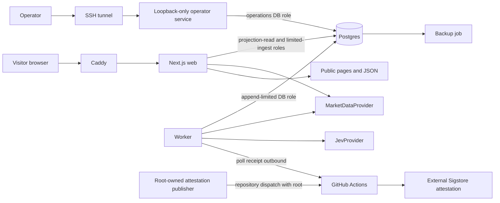
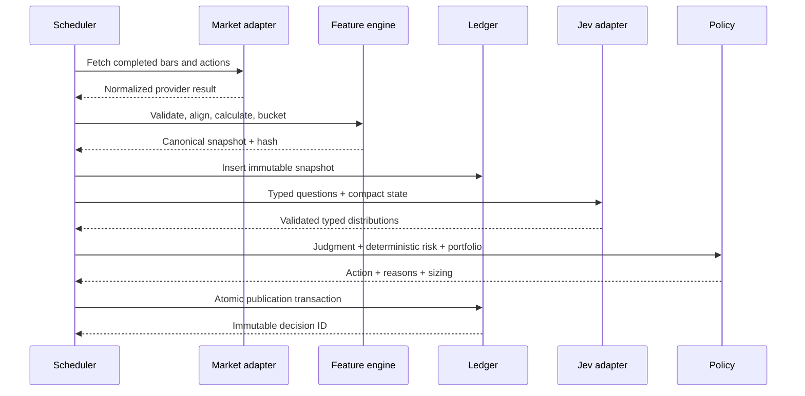
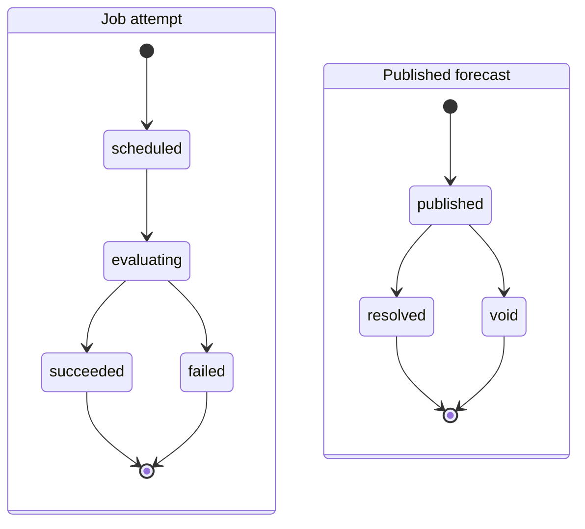
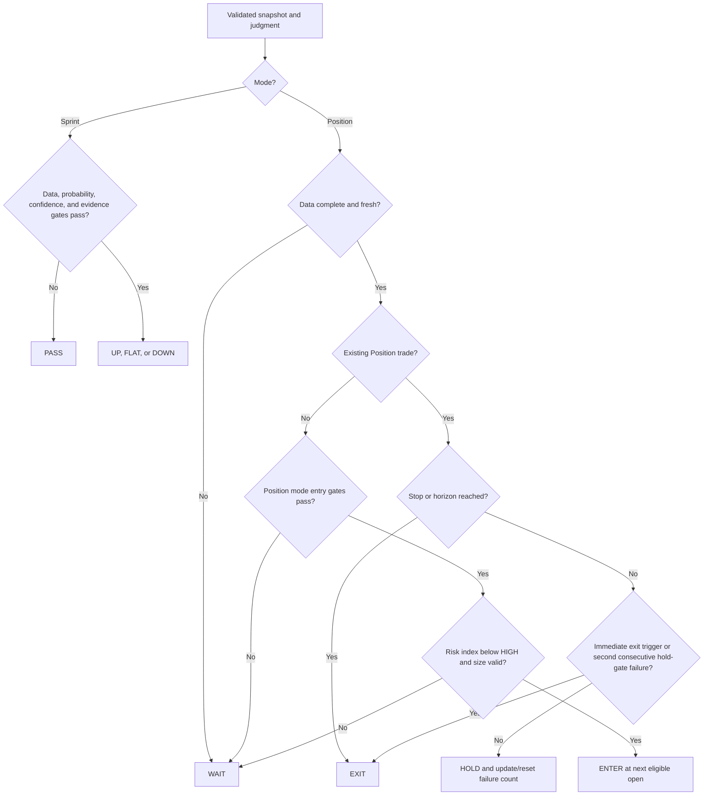
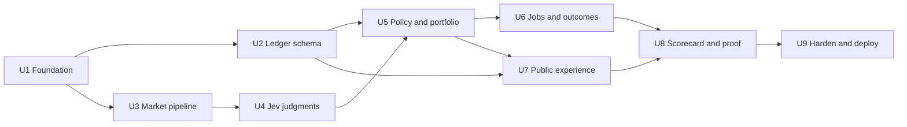

# Jev Trade prototype plan

## Goal Capsule

**Objective:** Publish a trustworthy market simulation in which anyone can inspect Jev's timestamped stock judgments, follow a shared paper portfolio, and see whether those judgments outperform simple baselines as real outcomes arrive.

**Means:** Build a box-hosted modular Next.js application with a deterministic feature and risk engine, typed Jev evaluations, an append-only decision ledger, a paper-trading policy, and a public scorecard (KTD1–KTD9).

**Authority:** This plan governs prototype scope and implementation. The user's latest direction governs hosting and domain ownership. Provider contracts govern data display and retention. Official TypeSafe documentation governs Jev's API behavior. When these conflict, legal data rights and simulation safety are hard constraints.

**Stop conditions:**

- Do not connect a broker, execute a real order, accept money, or create a real-money position.
- Do not publish or promote market data until the selected provider has confirmed the required display, storage, and derived-data rights.
- Do not label a Jev probability or confidence value as the chance of winning, losing, or making money.
- Do not rewrite or delete a published forecast because its outcome is inconvenient. Corrections append a new event and retain the original.
- Do not copy code, visual assets, or text from the unlicensed finance demos reviewed in the Appendix.
- Do not redirect or alter `jev-trade.com`; the project owner handles domains and the final host.

**Execution profile:** Deep, financial-domain prototype. Work in dependency order, keep deployable increments, and finish with a box deployment plus a rollback rehearsal. One implementation owner may build the modular monolith; an independent reviewer validates the decision ledger, leakage controls, disclosure language, and deployment evidence before promotion.

## Product Contract

### Summary

Jev Trade is a public experiment, game, and paper portfolio using real stock-market data. It turns a bounded, time-stamped market snapshot into narrow Jev judgments, applies transparent code-owned entry and exit rules, and later scores the frozen forecast against the realized market outcome.

The product's core promise is an honest record rather than a winning claim. A visitor can see what Jev knew, what it judged, what the policy did, and how that decision performed without trusting a screenshot or a rewritten narrative.

### Problem Frame

Most AI trading pages collapse several different concepts into one persuasive number: model confidence, market risk, expected return, and probability of profit. That makes the output hard to evaluate and easy to misrepresent. Existing Jev trading examples demonstrate API calls and feature construction, but they do not provide a licensed, prospective, recurring paper-trading product with an immutable scorecard.

The prototype must answer four questions:

1. Can Jev produce stable, useful directional and setup judgments from compact market states?
2. Do those judgments add value over simple price-based baselines when v1 supplies only price-, volume-, benchmark-, and structured calendar-derived descriptors?
3. Can users understand the difference between model belief, market volatility, and position loss?
4. Is the loop compelling enough to support a full product and YouTube promotion?

### Actors

- **Visitor:** explores symbols, forecasts, outcomes, the house portfolio, and methodology without signing in.
- **Operator:** controls the symbol universe, triggers or pauses jobs, records provider/model changes, and handles corrections through authenticated internal tools.
- **Scheduler:** creates snapshots, requests Jev judgments, applies policy, marks outcomes, and monitors open paper positions.
- **Data provider:** supplies price, corporate-action, exchange-calendar, benchmark, and structured issuer-event data under a contract compatible with the deployment.
- **Jev provider:** returns typed distributions and confidence metadata for atomic questions.

### Key Product Decisions

**KD1 — The public object is a house experiment.** The prototype has one shared paper portfolio and public forecast ledger, plus a no-account blind-pick game, with no personalized portfolios or recommendations. Governs R1, R2, R17, R22, R34, and R35.

**KD2 — Risk remains three distinct concepts.** The interface separates the Jev decision distribution, deterministic market-risk index, and deterministic position-risk amount. Governs R8–R12 and R28.

**KD3 — Jev judges; code calculates and acts.** Jev answers atomic semantic questions. Code owns dates, arithmetic, indicators, thresholds, policy composition, sizing, fills, and scoring. Governs R5–R7, R10–R16, and R19.

**KD4 — Public truth comes from a prospective ledger.** Every prediction is frozen before the evaluation window begins, then resolved automatically without mutation. Governs R3, R4, R18–R25, and R29.

**KD5 — The first market is deliberately narrow.** The initial universe is 20–50 liquid US-listed equities with end-of-day or clearly licensed delayed data. ETFs and other instrument classes wait until their event and risk semantics can be calibrated separately. Governs R26, R27, R30, and R31.

### Requirements

#### Experience and modes

- **R1.** The public home page shows the latest Jev judgments, the current house paper portfolio, recent resolved forecasts, headline scorecard metrics, and data freshness.
- **R2.** A visitor can search or choose a symbol from the operator-approved universe and open a detail page without creating an account.
- **R3.** Every forecast card shows the symbol, mode, horizon, cutoff timestamp, latest included market session, model and policy version labels, status, and immutable decision identifier.
- **R4.** Job attempts move through `scheduled`, `evaluating`, and `succeeded` or terminal `failed`. A successful attempt publishes an immutable forecast whose lifecycle is `published` to terminal `resolved` or `void`. Retries append job attempts and never move a published forecast backward.
- **R5.** Position mode evaluates a long-only setup over 20 completed trading sessions.
- **R6.** Sprint mode predicts `up`, `flat`, or `down` over either 1 or 5 completed trading sessions. It scores a direction contract and never represents a real or paper short sale.
- **R7.** The displayed action is one of `ENTER`, `HOLD`, `EXIT`, or `WAIT` in Position mode, and `UP`, `FLAT`, `DOWN`, or `PASS` in Sprint mode.

#### Judgment and risk semantics

- **R8.** The Jev panel shows the complete typed distribution for direction, its confidence label, setup-quality score, downside-hazard score, and evidence-sufficiency score.
- **R9.** Copy beside the Jev panel states that its probability distribution is a model judgment and has not been calibrated as a probability of profit.
- **R10.** Code calculates a 0–100 market-risk index from declared, versioned inputs. The initial components are volatility percentile (35%), drawdown severity (20%), normalized ATR (20%), gap risk (10%), and known event proximity (15%).
- **R11.** The market-risk bands are `LOW` for 0–34, `MEDIUM` for 35–64, and `HIGH` for 65–100. The methodology labels these cutoffs as provisional heuristics until prospective data supports revision.
- **R12.** For an open Position trade, the app shows entry, stop/invalidation level, virtual shares, capital at risk, maximum planned portfolio loss, current paper P&L, and the assumptions behind each value.
- **R13.** The default paper equity is USD 100,000. A new Position trade may risk at most 1% of current paper equity at its stop, may use at most 20% of current equity as notional exposure, and may not take aggregate planned loss across open positions above 5% of equity or more than five simultaneous positions.
- **R14.** The initial stop distance is the greater of 2 × ATR(14) and 4% of entry price. A stop triggers when a completed session's unadjusted low is at or below the versioned stop level, then schedules the R15 next-open exit. All parameters and trigger bases are versioned; insufficient or extreme data forces `WAIT`.
- **R15.** Entry and exit fills use the next eligible session's unadjusted executable open plus a declared 10-basis-point adverse execution assumption per side. A new entry fills only if its publication-batch attestation receipt arrived before that open; otherwise the forecast becomes `EXTERNALLY_UNVERIFIED` with no paper position. Splits and cash dividends append paper events that adjust shares or cash. A forecast can never fill on a bar included in its input.
- **R16.** The policy derives actions from Jev outputs and risk gates. Jev never directly chooses position size or edits a fill.

#### Audit, outcome, and scoring

- **R17.** The house portfolio is append-only at the event level. Position state is a projection of deposit, entry, mark, split, cash-dividend, stop, exit, expiry, correction, and void events.
- **R18.** A published judgment stores the exact data cutoff, canonical derived state sent to Jev, source record references and content hashes, state hash, question-set version, typed Jev request/response, returned model version, policy version, and action. It stores no provider-native payload or raw licensed text.
- **R19.** Indicator computation, market-calendar operations, outcome labels, position sizing, and scores are deterministic and covered by fixture-based tests.
- **R20.** Direction forecasts always resolve on adjusted close-to-close return from the frozen cutoff close to the fixed horizon close, regardless of any paper-trade entry or early exit. Paper P&L resolves separately from simulated fills and exits.
- **R21.** Direction labels use explicit versioned neutral bands: ±2.0% for Position at 20 sessions, ±0.5% for Sprint at 1 session, and ±1.5% for Sprint at 5 sessions in v1. Boundary values are inclusive of `flat`.
- **R22.** The scorecard reports sample size, coverage/pass rate, multiclass Brier score, log loss where defined, reliability buckets, hit rate, paper return, maximum drawdown, and turnover. It never leads with hit rate alone.
- **R23.** The scorecard compares Jev to at least `always up`, the mode's deterministic momentum baseline, and the eligible-universe buy-and-hold benchmark. Random baselines use a stored seed.
- **R24.** Historical replay is labeled exploratory. Only predictions created and hashed before their horizon begins count toward the public prospective record.
- **R25.** Voids remain visible and are excluded from performance metrics with a machine-readable reason such as irrecoverable missing bar, corporate-action ambiguity, provider correction, or job failure. A halt or delisting after publication is not automatically void: use the provider's official delisting consideration or last defensible tradable value, and report a sensitivity view when no standard close exists so adverse lifecycle events are not silently removed.

#### Data quality and operations

- **R26.** A market snapshot contains symbol identity, exchange, currency, provider, latest completed session, at least 272 valid completed point-in-time adjusted and unadjusted daily OHLCV bars for both symbol and benchmark, every source bar referenced by its derived values, corporate-action metadata, and required structured event-calendar status. Adapters request at least 300 sessions to absorb holidays, gaps, and warm-up loss.
- **R27.** The compact Jev state contains derived semantic features rather than a raw price dump: returns and trend over 1/5/20/60/252 sessions, moving-average distance, RSI, ATR, realized volatility, drawdown, volume regime, gaps, relative strength, benchmark regime, upcoming known events, staleness, and missing-data flags.
- **R28.** The UI shows stale, incomplete, provider-unavailable, market-closed, and judgment-failed states. It never silently presents old data as current.
- **R29.** The v1 scored state sends Jev only approved derived descriptors, structured facts, source identifiers, and content hashes. It never persists or transmits raw licensed articles, filings, snippets, markup, or provider-native payloads. Rich text evidence remains deferred until both source rights and Jev-processor terms explicitly permit retention and onward AI processing.
- **R30.** The symbol universe is an operator-controlled allowlist. Delisted, halted, recently split, missing-benchmark, and insufficient-history symbols fail closed.
- **R31.** Scheduled evaluation occurs after a completed EOD bar is available. Open Position trades are reconsidered after each new completed bar, on stop/invalidation events, and at horizon expiry rather than on every tick.
- **R32.** Public pages identify the app as a simulation, link to the methodology, disclose data and execution assumptions, and avoid promises or language implying guaranteed returns.
- **R33.** Public display activates only after a provider-rights record names the provider, plan/contract, permitted fields, audience, retention, attribution, derived outputs, screenshots/video rights, onward AI processing, effective date, and reviewer; a separate Jev-processor record covers retention, training, residency, and deletion terms.
- **R34.** A visitor may make one no-account `UP`, `FLAT`, or `DOWN` pick for the displayed symbol and horizon before revealing Jev's published call, or skip directly to the reveal. The game records the frozen pick and later outcome without creating a personal portfolio.
- **R35.** Analytics is affirmative opt-in: no pseudonymous browser ID is generated and no analytics event is stored until the visitor accepts. The app then measures stock-view, pick, reveal, return, and share events using a random browser ID. Raw identifiers are purged from live storage within 30 days and age out of encrypted backups within the additional 28-day backup window; only aggregates remain. Declining or ignoring the notice leaves every product flow usable.

### Core Flows

#### F1 — Explore a stock

1. The visitor selects an allowlisted symbol.
2. The page renders the latest completed market snapshot and freshness state.
3. The page separates Jev judgment, market risk, and paper position risk.
4. The visitor can inspect the compact evidence state, methodology version, prior forecasts, and outcomes.

#### F2 — Publish a new judgment

1. The scheduler confirms that the provider's completed bar is newer than the symbol's last snapshot.
2. Code validates and normalizes bars, corporate actions, benchmark alignment, and event dates.
3. Code computes the feature set and semantic buckets, then freezes a canonical state and hash.
4. The Jev adapter submits independent typed questions in one evaluation request.
5. The validator rejects malformed, incomplete, non-finite, or internally invalid typed answers.
6. The deterministic policy applies gates and calculates the action and any Position sizing.
7. One transaction appends the judgment, answers, policy decision, and forecast publication event.
8. The public ledger displays the new record only after that transaction commits.

#### F3 — Monitor and exit a Position trade

1. Each completed bar updates deterministic marks and checks the stop, horizon, and data-quality gates.
2. A new Jev judgment may update direction, quality, hazard, and sufficiency against the new cutoff.
3. The policy chooses `HOLD` or `EXIT`; stop and horizon rules override a contrary Jev judgment.
4. The next eligible unadjusted open supplies the simulated exit fill when an exit is scheduled.
5. The event ledger closes the paper position and records its realized P&L.
6. The original direction forecast remains open until its fixed 20-session close, so an early trade exit cannot change the forecast's evaluation window.

#### F4 — Resolve a Sprint prediction

1. The scheduler finds the exact Nth eligible market session after publication.
2. Code measures adjusted close-to-close return without using later data.
3. The versioned neutral band determines `up`, `flat`, or `down`.
4. The outcome record freezes the label, return, source-bar references, and scoring contributions.
5. Aggregate metrics refresh without changing the original prediction.

#### F5 — Correct bad source data

1. The operator marks the affected snapshot or outcome and records a reason.
2. The original records remain addressable.
3. A correction event references both the original and replacement data.
4. Metrics recompute from the valid event projection and the public ledger shows the correction.

#### F6 — Make a blind visitor pick

1. The stock page offers the visitor the same symbol and horizon as an already frozen Jev forecast without revealing Jev's choice.
2. The visitor selects `UP`, `FLAT`, or `DOWN`, or chooses `Reveal without playing`.
3. The server freezes a submitted pick with forecast ID and timestamp, then reveals Jev's card and policy action.
4. When the forecast resolves, the browser can show the visitor's result and the aggregate visitor-versus-Jev comparison.
5. The experience makes no claim that the browser token prevents deliberate cheating; it exists to test comprehension and repeat engagement.

### Acceptance Examples

- **AE1:** Given an AAPL snapshot whose latest bar is September 18 and a forecast published before September 19 opens, the September 19 unadjusted executable open may be used as a simulated entry; no September 19 close or later information may exist in the input hash.
- **AE2:** Given Jev chooses `up` with a concentrated distribution while deterministic market risk is 78, the card may show strong Jev conviction and `HIGH` market risk simultaneously; the v1 policy returns `WAIT`.
- **AE3:** Given a USD 100,000 paper portfolio, a USD 100 entry, and an 8% stop distance, the 1% loss cap allows 125 shares but the 20% exposure cap allows 200; the position is 125 shares and maximum planned loss is USD 1,000 before execution assumptions.
- **AE4:** Given a 1-session Sprint return of exactly +0.5%, the v1 inclusive neutral band resolves the outcome as `flat`; a return above +0.5% resolves `up`.
- **AE5:** Given a provider omits the benchmark bar or supplies a partial current-day bar, validation rejects publication and exposes `DATA_INCOMPLETE`; it does not ask Jev to guess.
- **AE6:** Given a Jev timeout after bounded retries, the run records `JUDGMENT_FAILED`, exposes no new action, and leaves an existing position under deterministic stop and horizon rules.
- **AE7:** Given a split correction arrives after resolution, the correction flow preserves the original forecast and outcome, appends the corrected outcome, and explains the scorecard change.
- **AE8:** Given only 12 prospective forecasts, the scorecard displays the metrics with the sample size and a low-sample warning; it makes no superiority claim.

### Success Criteria

- A cold visitor can explain the three risk concepts after using one stock page; moderated prototype checks target at least 4 of 5 correct explanations.
- Every public prediction can be reproduced from stored source references, canonical state, hashes, and versioned policy within one verification command.
- A 30-day soak completes at least 98% of scheduled eligible evaluations and receives timely external attestations for at least 98% of publication batches without duplicate publications; failed, void, and unverified runs remain visible.
- No test or audit can find future bars, future event knowledge, same-bar fills, mutable forecasts, or unversioned policy changes in a scored prospective record.
- The public scorecard always includes the three named baselines, sample size, and calibration metrics when it shows Jev results.
- Mobile pages remain usable at 400 CSS pixels and the primary stock view reaches WCAG 2.2 AA for keyboard navigation, landmarks, labels, focus, and contrast.
- If the YouTube launch and public release produce at least 500 consented eligible stock-detail sessions, at least 15% complete a blind pick and at least 10% of pickers return within seven days. Below 500 sessions the result is `NOT ENOUGH TRAFFIC`, not a failed engagement test; misses above that denominator trigger a product review rather than blocking forecast evidence.
- The box can be rebuilt from a clean checkout and environment file, restored from a backup, health-checked, and rolled back using the documented runbook.
- Product validation for a full app requires at least 100 resolved prospective forecasts across at least 20 symbols, at least 20 distinct resolution dates overall, and no fewer than 20 forecasts per active horizon. The scorecard states that same-session symbols and overlapping Position windows are correlated; this is a learning threshold, not a claim of statistical significance.

### Scope Boundaries

#### Included in the prototype

- One public house paper portfolio.
- US-listed equities from an allowlist.
- EOD or licensed delayed data.
- Position 20-session and Sprint 1/5-session modes.
- Public ledger, stock detail, methodology, scorecard, and shareable forecast/outcome cards.
- No-account blind picks and privacy-minimized aggregate engagement measurement.
- Operator controls needed to manage symbols, jobs, corrections, and version labels.
- Box-first container deployment with Vercel compatibility.

#### Deferred for later

- Visitor accounts, personal watchlists synced across devices, and personal paper portfolios.
- ETFs, intraday bars, streaming quotes, options, crypto, foreign markets, and extended-hours decisions.
- Rich licensed news, filings, earnings transcripts, social sentiment, and analyst estimate layers.
- Experiment assignment, alternative Jev question sets, ensemble models, and automatic threshold tuning.
- Native mobile apps, notifications, leagues, leaderboards, achievements, and community features.
- Paid plans, billing, referrals, and partner APIs.

#### Outside this product's identity

- Brokerage connectivity, order routing, custody, deposits, withdrawals, or copy trading.
- Personalized financial advice, suitability decisions, guaranteed-return language, or autonomous management of real capital.
- A black-box “buy now” signal without visible evidence, timestamps, methodology, and scored history.
- Editing or deleting prior forecasts to improve apparent performance.

### Dependencies and Launch Gates

| Dependency | Needed for implementation | Needed for public launch | Resolution |
|---|---:|---:|---|
| TypeSafe API key or compatible Jev provider | Yes for live evaluation; fixtures unblock development | Yes | Obtain key, pin a tested model version, record terms and limits |
| Market-data development key | Yes for live ingestion; fixtures unblock development | Yes | Use only within the provider's permitted development/internal scope |
| Public display/storage rights | No | Yes, blocking | Obtain written rights record for the selected provider and fields |
| Western Linux box | No for local build | Yes | Docker 24+, Compose v2, 2 vCPU, 4 GB RAM, 30 GB SSD minimum |
| Domain and DNS | No | No for IP/temporary host testing | Project owner handles the final domain separately |
| Legal/compliance review | No for private prototype | Yes before promotion | Review simulation copy, methodology, YouTube claims, privacy, and provider terms |
| YouTube traffic window | No | Needed only to evaluate engagement target | Publish after public gates pass; measure the first 500 consented eligible sessions |

Before U3 adds a live provider, the operator sends written terms requests and quotes using the exact R26–R35 data flow. A written answer or explicit stop is recorded before U7 exposes any live market field. If no candidate is acceptable to the project owner, implementation continues in fixture/private mode; public scorecards, share cards, and YouTube promotion remain disabled, and no private cohort is later published or counted as public prospective evidence unless the contract explicitly permits that use.

### Outstanding Questions

- **Launch-blocking:** Which market-data contract permits the final public fields, history, storage, charts, and derived scorecard? The adapter can be built before selection, but public display stays disabled until this is recorded.
- **Configuration, not scope:** Whether the first live Jev transport is TypeSafe direct or Vercel AI Gateway depends on credential availability. Both implement the same internal adapter; direct TypeSafe is the preferred box-first route.
- **Deferred decision:** The permanent domain route and final production host are owned by the project owner and do not block the temporary box deployment.

### Sources

- [`awesome-jev` finance index and warning](https://github.com/yibie/awesome-jev)
- [TypeSafe Jev introduction](https://docs.typesafe.ai/introduction)
- [TypeSafe quick start and HTTP API](https://docs.typesafe.ai/introduction/quickstart)
- [TypeSafe primitives](https://docs.typesafe.ai/primitives)
- [TypeSafe confidence guidance](https://docs.typesafe.ai/confidence)
- [Jev 1.13 model limitations](https://docs.typesafe.ai/model-jaggedness/jev-1.13)
- [Vercel AI Gateway Jev model](https://vercel.com/ai-gateway/models/jev)
- [SEC robo-adviser guidance](https://www.sec.gov/investment/2017-02-robo-advisers)
- [FINRA warning on auto-trading services](https://syndication.finra.org/content/know-risks-auto-trading-services-offered-unregistered-entities)

## Planning Contract

### Key Technical Decisions

**KTD1 — Deploy to our box first with a portable container stack.** *(session-settled: user-directed — chosen over Vercel-first: the user wants the prototype on the western box and will handle the final box and domain.)* Use one Node.js 22 image for the Next.js web command and worker command, Postgres 16 for durable state, and Caddy for TLS/reverse proxy. Keep the web process compatible with Vercel's Node runtime, but do not require Vercel services.

**KTD2 — Use a modular monolith.** Keep web pages, HTTP routes, domain services, adapters, and scheduled jobs in one TypeScript workspace. Isolate modules through imports and contracts rather than separate network services. This is the fastest shape that still supports extracting ingestion or evaluation later.

**KTD3 — Make the ledger append-only and derive projections.** Store source snapshots and published judgments immutably. Store paper actions as events and build current positions, scores, and public summaries as derived projections. Corrections reference prior records.

**KTD4 — Keep numerical truth outside Jev.** The feature engine emits exact values plus deterministic semantic buckets. Jev receives a compact canonical state and atomic typed questions. The policy composes the response with risk gates. This follows TypeSafe's published limitation that arithmetic, counting, dates, and structural invariants belong in code.

**KTD5 — Use an explicit provider boundary.** `MarketDataProvider` and `JevProvider` adapters normalize third parties into internal contracts. Fixtures are first-class adapters. Required structured event-calendar fields belong to `MarketDataProvider`; a separate rich-evidence adapter is deferred with the rich-evidence product scope. Provider payloads never leak directly into pages or domain logic.

**KTD6 — Pin and version the full judgment contract.** Pin a concrete Jev model after a live smoke test, store the returned model identifier, and version the compact-state schema, questions, policy, risk formula, outcome labels, and execution assumptions independently. A moving alias is allowed only in a non-scored sandbox.

**KTD7 — Run EOD jobs from a database-backed worker.** A long-running worker polls a Postgres job table, claims work with row locks, retries transient failures with bounded backoff, and records idempotency keys. This avoids a new queue dependency on a single host and moves cleanly to managed cron later.

**KTD8 — Ship a mostly read-only public surface and an isolated operator surface.** Public mutations are limited to strict blind-pick and consented analytics schemas backed by execute-only database procedures. Internal job, symbol, version, gate, and correction routes live on a loopback-only operator service reached through an SSH tunnel. There are no public accounts in v1.

**KTD9 — Gate promotion separately from deployment.** A box deployment can run with fixtures or internal-use data behind access controls. A public/promoted state requires the provider-rights record, production secrets, rate limits, disclosures, backup/restore evidence, and independent review.

### Alternatives Considered

| Choice | Decision | Reason |
|---|---|---|
| Vercel hosting first | Keep as fallback | Fast deploys are attractive, but the user selected a western box first and the app does not need Vercel-specific infrastructure |
| Microservices | Reject for prototype | Extra deploy, tracing, and failure surfaces do not improve the first experiment |
| Let Jev output `BUY/SELL` and risk percent | Reject | It conflates judgment with arithmetic and creates a misleading probability claim |
| Full user paper-trading accounts | Defer | Auth and multitenancy do not answer whether Jev adds value |
| Live/intraday market data | Defer | Cost, licensing, and operational complexity are disproportionate to the initial hypothesis |
| Retrospective backtest as launch proof | Reject | A current model may know historical events; forward forecasts are the trustworthy evidence |
| Copy Jevinik or `jev_stock` | Reject | Neither reviewed repository grants a reuse license, and neither supplies the full product loop |
| Add Redis/queue infrastructure | Defer | Postgres jobs are adequate for the expected EOD volume and simpler to operate on one box |

### High-Level Technical Design

The diagrams communicate responsibility and flow. Exact module boundaries may change during implementation while these contracts remain true.

#### Component relationships



#### Judgment data flow



#### Job and forecast lifecycles



A transient retry appends a new job attempt under the same operation idempotency key. An operator replay after terminal failure creates a new scheduled operation linked to the failed attempt. Resolution-job failure leaves the published forecast unchanged until a later attempt appends `resolved` or `void`.

#### Policy decision tree



### Initial Jev Contract

All questions share the same frozen state and are independent. Wording is versioned and tested on fixtures before scored use.

| ID | Primitive | Options/legend | Purpose |
|---|---|---|---|
| `direction` | Choice | `up`, `flat`, `down` | Direction at the named horizon |
| `setup_quality` | Score | `poor`, `weak`, `adequate`, `strong` | Coherence of trend, relative strength, and regime |
| `downside_hazard` | Score | `low`, `moderate`, `high`, `severe` | Semantic hazard given supplied evidence |
| `evidence_sufficiency` | Score | `insufficient`, `thin`, `adequate`, `rich` | Whether the state supports a decision |

The app does not ask logically mirrored questions such as both “will it rise?” and “will it not rise?” because independent answers need not sum consistently. The response validator requires known answer IDs, types, options, finite distributions, probability bounds, and normalized sums within a documented tolerance.

### Initial Market-Risk Formula

The v1 index is a transparent heuristic, rounded to the nearest integer after summing these bounded components:

| Component | Points | Deterministic v1 definition |
|---|---:|---|
| Volatility percentile | 0–35 | `35 × percentile_rank` of 20-session annualized realized volatility against the symbol's trailing 252-session observations |
| Drawdown severity | 0–20 | `20 × clamp(abs(min(60-session drawdown, 0)) / 0.20, 0, 1)` |
| Normalized ATR | 0–20 | `20 × clamp((ATR(14)/close - 0.01) / 0.05, 0, 1)` |
| Gap risk | 0–10 | `10 × percentile_rank` of the largest absolute overnight gap in the trailing 20 sessions against rolling 20-session maxima in the trailing year |
| Event proximity | 0–15 | 15 within 2 eligible sessions of a known issuer event, 8 within 3–5, otherwise 0 |

Percentile ranks use the empirical fraction of valid observations less than or equal to the current value, with exact ties receiving the same rank. The final sum is clamped to 0–100 and rounded half away from zero. Missing or stale structured event status, too few percentile observations, invalid corporate-action adjustment, or a non-finite component yields `DATA_INCOMPLETE` and `WAIT`/`PASS`; the engine never renormalizes the remaining weights.

### Initial Policy v1

- **Position ENTER:** `direction=up` probability is at least 0.60; direction confidence is at least 0.50; setup-quality and evidence-sufficiency scores are each at least 2.0 on their 0–3 scales; downside-hazard score is at most 1.0 on its 0–3 scale; each Score confidence is at least 0.50; market risk is below HIGH; and sizing is valid.
- **Position HOLD:** an open position has no deterministic exit event; selected direction is `up` or `flat`; direction confidence is at least 0.50; downside-hazard score is below 2.0; and each used Score confidence is at least 0.50. A passing judgment resets the consecutive failure count.
- **Position EXIT:** stop or horizon always exits; otherwise exit on `direction=down` probability of at least 0.55, downside-hazard score of at least 2.0 with confidence at least 0.50, invalidated data, or two consecutive eligible judgments that fail the hold gate.
- **Position provisional HOLD:** when the hold gate fails once but no immediate exit trigger fires, retain `HOLD`, record failure count 1, and expose the warning in the gate trace; a second consecutive failure exits.
- **Position WAIT:** any entry gate fails. Waiting is a first-class outcome and contributes to coverage.
- **Sprint UP/DOWN:** the selected class has probability at least 0.55, direction confidence is at least 0.50, evidence-sufficiency score is at least 2.0, and evidence-sufficiency confidence is at least 0.50.
- **Sprint FLAT:** `flat` satisfies the same numeric gate.
- **Sprint PASS:** no class satisfies the gate or data quality fails.

The interface derives labels from numeric values: confidence `<0.50` is low, `0.50–0.74` medium, and `≥0.75` high; Score display labels use the nearest level with halves rounded toward the more cautious action. These thresholds are starting hypotheses. Change them only by publishing a new policy version; never retune v1 against its scored outcomes and rewrite history.

Policy v1 has a pre-registered coverage checkpoint after at least 100 eligible decisions for the affected mode and no fewer than 20 completed sessions. Position `ENTER` coverage below 5%, or Sprint non-`PASS` coverage below 25%, triggers a documented policy-v2 review. V1 remains published and separately scored; the checkpoint never changes or discards its cohort. High coverage is reported but does not auto-tighten the policy.

When several Position candidates share a cutoff, rank lower market-risk index first, then higher `up` probability, then symbol alphabetically. Fill in that order until cash, five-position, notional, or aggregate-loss limits bind. Every candidate stores its rank and fill or no-fill reason so worker execution order cannot select the portfolio.

### Initial Scoring and Baselines

- Forecast scoring uses the full three-class distribution and the fixed-horizon label. Multiclass Brier is the mean squared error across `up`, `flat`, and `down`; log loss clips only for calculation at epsilon `1e-15` and preserves the original stored distribution.
- `always up` emits the one-hot `up` class. Its infinite unclipped log loss remains explainable through the documented calculation clip.
- The momentum baseline emits `up`, `flat`, or `down` from the trailing return matching the forecast horizon, using the same neutral band as that horizon. It is calculated from the exact frozen snapshot.
- Buy-and-hold is a portfolio comparator over the eligible universe with the same starting equity and evaluation dates; it is not presented as a calibrated direction model.
- Any random comparator uses a stored seeded sequence and equal class probabilities unless its version declares another distribution.
- Reliability buckets are defined before the cohort and merge adjacent buckets when fewer than 20 resolved observations would otherwise appear, so sparse charts do not imply precision.
- The scorecard displays raw forecast count and distinct resolution-date count together. Jev-versus-baseline deltas are first averaged within each resolution date and then summarized across dates, so a market-wide move is not treated as dozens of independent observations. Overlapping 20-session Position windows remain explicitly labeled as correlated.

### Data Model

| Entity | Purpose | Immutability rule |
|---|---|---|
| `symbols` | Operator allowlist and exchange identity | Mutable configuration with audit timestamps |
| `provider_rights` | Evidence of fields, audience, storage, attribution, onward processing, media use, and dates permitted | Append revisions; one must be active for public mode |
| `processor_terms` | Jev retention, training, residency, and deletion terms reviewed for the transmitted state | Append revisions; one must be active for scored live mode |
| `market_bars` | Normalized completed adjusted/unadjusted OHLCV and corporate-action references | Append source revisions; snapshots reference an exact revision |
| `market_snapshots` | Canonical input set, derived features, cutoff, source refs, hash | Immutable after a judgment references it |
| `evidence_descriptors` | Approved structured facts, derived descriptors, source IDs, and content hashes | No raw licensed text; retention follows provider rights |
| `judgment_runs` | Provider/model/question versions, timing, status, raw typed response | Immutable successful run; retry is a new attempt |
| `judgment_answers` | Normalized choices/scores, distributions, confidence | Immutable |
| `policy_decisions` | Policy version, gates, reasons, action, sizing | Immutable |
| `forecast_events` | Publication, resolution, void, and correction ledger | Append-only |
| `paper_events` | Deposit, entry, mark, split, cash-dividend, exit, stop, expiry, correction | Append-only |
| `forecast_outcomes` | Realized label, return, score contributions, bar refs | Immutable; corrections append a replacement selected by the active projection |
| `job_runs` | Idempotency, attempts, leases, errors, and timings | Append attempts and terminal result |
| `ledger_roots` | Publication-batch hash-chain root, previous root, attestation deadline, GitHub artifact and attestation references | Append-only; timely external attestation is authoritative for prospective inclusion |
| `visitor_picks` | Forecast-linked no-account UP/FLAT/DOWN pick and later result | Append-only result; raw browser token leaves live storage within 30 days and backups within 58 days total |
| `analytics_events` | Affirmatively consented view, pick, reveal, return, and share events | Raw pseudonymous IDs leave live storage within 30 days and backups within 58 days total; aggregate counts remain |

Use ULIDs for externally visible records so time ordering is inspectable without exposing sequential counts. The canonical state hash is SHA-256 over a stable JSON serialization that excludes secrets, transient request IDs, and display-only text.

### Repository Shape

```text
jev-trade/
├── app/                       # Next.js pages, route handlers, layouts
├── components/                # accessible UI and chart components
├── modules/
│   ├── market/                # provider contract, normalization, calendar, features
│   ├── judgment/              # Jev contract, adapters, validation, fixtures
│   ├── policy/                # risk index, actions, position sizing
│   ├── ledger/                # forecasts, events, outcomes, projections
│   ├── scorecard/             # baselines, calibration, performance metrics
│   └── operations/            # jobs, operator authorization, health
├── db/                        # schema, migrations, seeds
├── worker/                    # scheduled job entrypoint
├── tests/                     # integration, fixtures, leakage and invariants
├── e2e/                       # Playwright public/operator flows
├── deploy/                    # Docker, Compose, Caddy, backup and rollback scripts
└── docs/
    ├── plans/                 # canonical unified plan
    └── runbooks/              # deployment, recovery, correction, incident response
```

### API Surface

Public routes return projections and never provider-native payloads:

- `GET /api/v1/home`
- `GET /api/v1/symbols?query=`
- `GET /api/v1/symbols/:symbol`
- `GET /api/v1/forecasts/:id`
- `GET /api/v1/scorecard?mode=&horizon=`
- `GET /api/v1/methodology/versions`
- `GET /health/live` and `GET /health/ready`
- `POST /api/v1/picks`
- `POST /api/v1/analytics/events`

Operator routes run in a separate service bound to loopback. They are reached only through an SSH tunnel, use short-lived HttpOnly `Secure` `SameSite=Strict` sessions after a bootstrap login, and are never routed by public Caddy:

- `POST /api/internal/symbols`
- `POST /api/internal/jobs/evaluate`
- `POST /api/internal/jobs/resolve`
- `POST /api/internal/corrections`
- `POST /api/internal/public-mode`

The two bounded public submission routes accept strict small schemas, same-origin requests, rate limits, and an existing eligible forecast ULID that is revalidated server-side. No forecast-ID signing secret exists. A separate `public_ingest` database role can execute only the pick/event procedures; the web projection role remains read-only. Duplicate picks return the frozen existing result without revealing Jev early, and analytics refusal makes the event route a no-op.

All operator mutation routes require idempotency keys and origin checks. The root-readable bootstrap secret supports documented rotation and immediate session revocation. Public responses expose data freshness and methodology versions. Errors use stable codes and public messages; internal causes remain in structured logs.

### User Interface

1. **Home:** current experiment status, latest forecasts, open Position trade, resolved cards, scorecard snapshot, freshness and simulation disclosure.
2. **Stock detail:** price chart, compact market state, separate Jev/market-risk/position-risk panels, current action, decision timeline, and prior outcomes.
3. **Forecast detail:** immutable inputs and versions, distributions, policy gate trace, virtual fill, resolution, correction history, and a shareable visual card.
4. **Portfolio:** cash, exposure, open/closed paper positions, equity curve, drawdown, and event ledger.
5. **Scorecard:** prospective filter by mode/horizon/model/policy, calibration chart, baselines, coverage, P&L, drawdown, and sample warnings. A visually separate `Visitor game` section labels its aggregate as an uncontrolled, unauthenticated engagement sample outside the attested Jev record.
6. **Methodology:** data timing, formulas, labels, execution assumptions, Jev limitations, correction policy, disclosures, and provider attribution.
7. **Operator:** minimal loopback-only status page, reached through an SSH tunnel, for universe, queues, failed jobs, versions, public-mode gate, and corrections.

Use TradingView Lightweight Charts only after preserving its required attribution. The semantic HTML table remains the accessible equivalent of chart-only data. Every async panel has loading, empty, stale, partial, failed, and success states.

#### Page hierarchy and navigation

- Persistent public navigation contains `Explore`, `Portfolio`, `Scorecard`, and `Methodology`; the Jev Trade mark returns Home. Stock and Forecast routes add contextual links to each other and to the relevant methodology version.
- Home leads with symbol search and the newest timestamped judgment. Experiment status, data freshness, and the simulation label sit beside that judgment rather than in a footer.
- Stock detail reads in this order: symbol and freshness; blind pick/reveal; current Jev judgment and policy action; the three distinct risk concepts; chart and semantic data table; evidence state; decision history.
- Forecast detail is the permanent audit view. Portfolio and Scorecard link every result back to its forecast and versioned methodology.
- A visitor never needs the Portfolio or Scorecard to understand whether the current stock card is stale, simulated, or unresolved.

#### Public-state behavior

| State | Home / Stock | Forecast | Portfolio / Scorecard | Visitor action and recovery |
|---|---|---|---|---|
| Loading | Preserve page headings and use labeled skeleton regions | Preserve immutable ID/title if known | Preserve filters and table headings | Disable pick/reveal until identity loads; announce completion once |
| Empty | Explain that no eligible forecast exists; show freshness and symbol search | Return a stable not-found or not-yet-published state | Show zero sample and no-performance copy | Offer another allowlisted symbol; never fabricate a call |
| Stale | Show last completed data with a prominent `STALE — HISTORICAL ONLY` banner; suppress current-action styling | Keep the frozen forecast and its original cutoff | Retain historical metrics with last-refresh time | Disable new pick on stale cohort; link methodology and retry status |
| Partial / incomplete | Show only validated fields and name missing inputs; no Jev action | Keep any already-published immutable content | Exclude incomplete records and show count | No entry/pick; offer refresh or another symbol |
| Failed | Show last successful forecast only as historical and name whether data, Jev, or job failed | Keep published forecast; show failed resolution job separately | Preserve prior aggregates and delayed-refresh banner | Public has no retry control; operator receives job link |
| Corrected | Show correction banner and active values | Show original plus append-only correction chain | Recomputed metrics show correction timestamp | Link the reason and affected source records |
| Void | Remove current action styling and show machine-readable reason in plain language | Preserve full frozen record and void event | Exclude from metrics while reporting void count | Link methodology; no replay from public UI |
| Resolved | Show realized label and link outcome | Show forecast, fixed-horizon outcome, and separate paper P&L | Include under exact version filters | Offer next blind pick and share card |
| Current success | Show cutoff, freshness, blind pick/reveal, and action | Show complete audit record | Show aggregates with sample warning when required | Enable only the actions permitted by the current state |

Status changes use text, icon, and color together. Dynamic status regions use restrained `aria-live` announcements and never repeatedly announce market ticks.

#### Responsive behavior

- At 400 pixels, stock content becomes one column in the defined reading order; judgment and each risk concept remain separate cards.
- Charts never force page-level horizontal scrolling. The equivalent data table becomes labeled stacked rows on small screens and remains available when the chart is hidden or fails.
- Scorecard filters collapse into one labeled filter region with an explicit Apply action and a summary of active filters.
- Forecast timelines and portfolio ledgers become key/value rows on small screens; desktop tables retain headers and visible units.
- Touch targets are at least 44 × 44 CSS pixels. Focus order follows visual order at every breakpoint, and no essential meaning exists only in hover content.

#### Operator interaction contract

| Operation | Preconditions and impact preview | Confirmation and audit result |
|---|---|---|
| Change allowlist | Validate symbol, history, benchmark, event status, and estimated call impact | Confirm add/remove; append actor, before/after, reason, and timestamp; blocked symbols never enqueue |
| Replay failed job | Show original operation, attempts, failure class, cutoff, and whether replay can duplicate a side effect | Confirm idempotency key/replay link; append new attempt; show committed result or terminal failure |
| Pause/resume jobs | Show affected modes, symbols, next windows, and open positions still protected by deterministic exits | Confirm scope/duration; append control event; banner remains until resumed |
| Activate model/question/policy version | Show fixture, repeatability, compatibility, and cohort boundary results | Confirm effective cutoff; append activation event; never reassign old forecasts |
| Enable public mode | Require rights, processor terms, disclosure, HTTPS, restore, rollback, and review gates | Require typed confirmation; append gate evidence and activation event; failed prerequisite names the blocker |
| Correct source/outcome | Follow F5 with affected forecasts, score deltas, and immutable original preview | Confirm reason and replacement; append correction; show projection rebuild result |

### Security, Privacy, and Abuse Controls

- Keep every provider and operator secret server-side; redact known secret fields and authorization headers before logging.
- Supply market-data, Jev, GitHub-dispatch, and operator secrets through root-owned host environment files mounted only into the process that needs each value. Never bake them into images or commits. The incident runbook names owner, rotation, revocation, and cost/contract checks for each credential.
- Give public web, public ingest, worker, operator, backup, and migration work separate Postgres roles. Public web reads projections only; public ingest executes only bounded pick/event procedures; the worker appends within domain procedures; operator mutations are narrow; only the one-shot migration role owns schema changes.
- Validate symbols against the allowlist and never turn visitor input into arbitrary provider URLs.
- Do not persist or send raw provider HTML, news, filings, or snippets in v1. Adapters may emit permitted structured facts, derived descriptors, source IDs, and content hashes only.
- Place a hard daily and per-run budget on provider and Jev calls. Enforce public endpoint rate limits at the application layer for the single-host prototype.
- Apply Content Security Policy, secure cookies, safe cache headers, and HSTS on a stable hostname. Require trusted HTTPS for every externally reachable route; when no certificate-backed hostname exists, bind all services to loopback and use an SSH tunnel.
- Store no visitor financial profile or personal portfolio in v1. Retain coarse request telemetry with keyed IP minimization for at most 14 days; analytics consent and retention follow R35 separately.
- The operator session expires after 15 minutes idle and one hour absolute. Bootstrap login permits five failures per 15-minute window, applies exponential delay, records an alert, and supports immediate session revocation.
- Place web and operator on separate Compose networks; each can reach Postgres through its own network, while no container route exists from web to operator. Publish the operator port on host loopback only.
- Encrypt backups to an age public key on the box; keep the corresponding decryption private key off-host. Keep off-host destination credentials root-readable and outside application containers.
- Label visitor-pick aggregates as unauthenticated engagement signals, separate from the prospective Jev evidence record. Cap pick submissions per minimized IP, browser token, and forecast.
- Generate a software bill of materials and run dependency and container scans before promotion.

### Operations and Deployment

- Build a multi-stage Docker image as a non-root user. Run `web`, `worker`, and loopback-only `operator` as separate Compose services from that image.
- Keep Postgres on a private Compose network with a named volume; expose only Caddy's HTTP/HTTPS ports.
- Configure Caddy through an environment-provided certificate-backed hostname. Before a hostname is available, keep the stack private and access it through SSH port forwarding. Do not hardcode `jev.conectta.co` or `jev-trade.com`.
- Run migrations as an explicit one-shot release command before starting the new web/worker version.
- Use structured JSON logs with request/job/forecast IDs and no raw licensed payloads or secrets.
- Back up Postgres daily, encrypt off-host, keep seven daily and four weekly copies, and perform one restore rehearsal before public promotion.
- Health readiness checks database reachability, applied migration version, and worker heartbeat; it does not make a paid Jev or data call.
- Roll back the web and worker image together. Database migrations must be expand/contract compatible for one prior image version.
- Development mode defaults to fixtures. `PUBLIC_MARKET_DATA=false` prevents market fields and charts from being served until the rights record is active.
- Each completed publication batch closes a new hash-chain root with a deadline before the next eligible market session opens. A root-owned host timer, isolated from application containers, sends that minimal root through a fine-grained GitHub `repository_dispatch`; its token cannot read private application data or modify releases. GitHub Actions verifies the previous published link, creates a Sigstore-backed artifact attestation through OIDC, and publishes the root JSON outside the application database. The worker polls GitHub outbound for the receipt, so no inbound attestation-write route exists and the control works before a public hostname is attached. Forecasts whose receipt misses the deadline remain visible as `EXTERNALLY_UNVERIFIED` and are permanently excluded from the prospective scorecard; there is no late-admission grace window. Any miss pages the operator, and more than 2% missed roots in a rolling 30-day window fails the promotion reliability gate. The public verification command checks the chain, receipt, and deadline. This proves publication time and detects later rewriting; it cannot prove a pre-deadline root was correct.

### Delivery Sequence



The evidence path is U1 → U2 and U3 in parallel → U4 → U5 → U6, so the prospective clock starts as soon as a permitted live feed is available. U7 can build a fixture-only visual demo in parallel after U5, but it must not delay U6; U8 and U9 then add public proof and the box deployment.

### Fast Prototype Schedule

This is an execution target for one focused implementation stream, not a promise about third-party contract response times:

| Working window | Target | Exit evidence |
|---|---|---|
| Day 0, parallel | Send provider-rights requests; obtain Jev credential; confirm box prerequisites | Written requests/quotes logged; no spend assumed |
| Day 1 | U1 foundation and U2 ledger skeleton | Compose health, migrations, event replay, DB-role tests |
| Day 2 | U3 fixture and live-adapter boundary | Golden features, risk vectors, no-future-data proof |
| Day 3 | U4 Jev integration and U5 policy/portfolio | Typed live smoke, repeatability cohort, action/sizing fixtures |
| Day 4 | Start U6 first; build U7 public/operator experience in parallel | Prospective clock running when permitted, accelerated EOD loop, critical browser journeys |
| Day 5 | U8 scorecard, baselines, blind-pick result, external roots | Golden metrics and attestation verification |
| Day 6 | U9 hardening and western-box deployment | Restore, rollback, security scan, fixture soak started |
| Following 48 hours | Restricted live-data soak if contract permits | Job completeness, no duplicate decisions, bounded cost |
| Following 30 days | Prospective operating evidence before promotion claim | Reliability, scorecard integrity, comprehension, and engagement review |

If market-data rights lag, the fixture/private build and Jev repeatability work continue. The app does not expose unlicensed live fields merely to hold the schedule.

## Implementation Units

### U1. Application and box foundation

**Goal:** Establish a reproducible Node.js 22 workspace and container stack that serves a health page locally and on the target Linux host.

**Requirements:** R28, R32. **Dependencies:** None. **Decisions:** KTD1, KTD2, KTD9.

**Files:** `package.json`, `pnpm-lock.yaml`, `next.config.ts`, `tsconfig.json`, `app/`, `deploy/Dockerfile`, `deploy/compose.yaml`, `deploy/Caddyfile`, `.env.example`, CI workflow.

**Approach:** Create the Next.js TypeScript shell, design tokens, error boundaries, structured logger, configuration schema, web/worker/operator commands, Postgres service and least-privilege roles, health checks, and CI gates. Bind the operator service to loopback, make fixtures the safe default, and require an explicit public-data flag.

**Test scenarios:**

- A clean checkout with documented environment values installs, migrates, builds, and serves `/health/live` through Compose.
- Missing required production secrets fails startup with field names but never values.
- Fixture mode starts without network credentials, while live provider mode rejects missing provider configuration.
- SIGTERM stops idle web, worker, and operator processes cleanly.
- The public database role cannot append or mutate domain records; the worker cannot change schema; the operator cannot assume migration ownership.

**Verification:** `pnpm lint`, `pnpm typecheck`, `pnpm test`, `pnpm build`, and `docker compose -f deploy/compose.yaml config` pass.

### U2. Database, immutable ledger, and projections

**Goal:** Implement the schema and repositories that make forecasts and paper positions auditable and correctable without mutation.

**Requirements:** R3, R4, R17–R19, R24, R25, R33–R35. **Dependencies:** U1. **Decisions:** KTD1, KTD3, KTD6.

**Files:** `db/schema/`, `db/migrations/` including `ledger_roots`, `modules/ledger/`, `modules/operations/provider-rights.ts`, ledger fixtures and integration tests.

**Approach:** Define constraints for state transitions, unique snapshot hashes, publication idempotency, one active resolution projection, version labels, event references, visitor picks, consented analytics, and identifier expiry. Add canonical JSON and hashing. Keep corrections append-only and rebuild projections from events in tests. Enforce public-mode rights/processor gates here because this unit owns those records.

**Test scenarios:**

- Replaying the same publication key creates one forecast and returns its existing ID.
- Attempts to update immutable snapshot or judgment fields fail at both repository and database layers.
- A correction preserves the original, changes the active projection, and rebuilds to the same result from an empty projection table.
- Failed job attempts remain terminal, retries append attempts, published forecasts never move backward, and resolution retries do not create new judgments.
- Invalid lifecycle transitions, orphan events, duplicate active outcomes, and public mode without rights are rejected.
- Duplicate blind picks return one frozen pick; analytics refusal stores no event; raw pseudonymous IDs expire after 30 days while aggregates remain.

**Verification:** Migration up/down on a disposable database, repository integration suite, and ledger replay invariant test pass.

### U3. Market-data normalization and deterministic features

**Goal:** Turn provider or fixture data into a validated point-in-time snapshot and exact risk inputs without future leakage.

**Requirements:** R10, R11, R19, R21, R26–R30. **Dependencies:** U1. **Decisions:** KTD4, KTD5.

**Files:** `modules/market/contracts.ts`, `modules/market/providers/`, `modules/market/calendar/`, `modules/market/features/`, `modules/policy/market-risk.ts`, market fixtures and property tests.

**Approach:** Implement provider-neutral bars/actions, US exchange-session handling, adjustment validation, benchmark alignment, staleness rules, numerical indicators, percentile buckets, and canonical compact state. Start with deterministic fixtures and add the selected development provider behind the same contract.

**Test scenarios:**

- A split, missing session, duplicate bar, partial current bar, stale source, non-finite number, stale event calendar, and benchmark mismatch each produce the documented fail-closed result.
- Feature calculations match hand-checked golden fixtures at warm-up boundaries and across a daylight-saving transition.
- Appending future bars does not change a snapshot at an earlier cutoff.
- The 0–100 risk formula preserves component weights and exact 34/35/64/65 band boundaries.

**Verification:** Golden vectors, property tests for finite/bounded outputs, and a no-future-data metamorphic test pass.

### U4. Jev provider and judgment engine

**Goal:** Produce validated, versioned typed Jev judgments from the compact state with fixtures, bounded retries, and observable failures.

**Requirements:** R8, R9, R18, R27–R29. **Dependencies:** U3. **Decisions:** KTD4–KTD6.

**Files:** `modules/judgment/contracts.ts`, `modules/judgment/questions/`, `modules/judgment/providers/typesafe.ts`, optional gateway adapter, sanitizer, validators, fixtures and contract tests.

**Approach:** Implement the four-question contract, direct TypeSafe transport, canonical request construction, timeout/retry policy for transient statuses, strict response validation, response-model capture, safe evidence boundaries, and a deterministic fixture adapter. Add gateway transport only when credentials favor it.

**Test scenarios:**

- Valid responses preserve every distribution and confidence field without inventing a win probability.
- Missing answers, unknown options, NaN, out-of-range probabilities, invalid sums, timeout, 429, server failure, and schema drift yield classified failures.
- Retryable responses retry within the cap; authentication and validation failures do not retry.
- Adversarial evidence text remains inside the data boundary and cannot add questions or modify policy fields.

**Verification:** Offline contract suite passes for every fixture; one credentialed smoke test records latency and returned model without storing the key or licensed payload. A non-scored repeatability cohort runs 20 representative frozen snapshots 10 times each with identical model and question versions, reports distribution drift, entropy/concentration, and policy-action agreement, and excludes every rerun from public performance metrics. At least 90% action agreement per snapshot is a blocking gate for opening a scored cohort. A miss publishes the measured result, increments the question/model contract version, and reruns the cohort; repeated failure stops the scored track rather than hiding model instability.

### U5. Policy engine and paper portfolio

**Goal:** Convert validated judgments and exact risk inputs into deterministic, explainable actions and event-sourced paper positions.

**Requirements:** R5–R7, R12–R16, R17, R20, R21. **Dependencies:** U2, U4. **Decisions:** KD2, KD3, KTD3, KTD4, KTD6.

**Files:** `modules/policy/`, `modules/ledger/paper/`, policy tables/fixtures, unit and integration tests.

**Approach:** Implement policy v1 as ordered gates, pure sizing functions, next-open execution, execution cost, cash/exposure constraints, stop/horizon precedence, two-failure exit memory, and full reason traces. Keep Sprint scoring outside the paper position ledger.

**Test scenarios:**

- AE2–AE4 produce the exact expected action, size, risk amount, and Sprint label.
- Stop and horizon override `HOLD`; no entry occurs on the input bar; insufficient cash or fractional invalid size returns `WAIT`.
- A completed session low exactly at the stop triggers a next-open exit; one hold-gate failure remains `HOLD` with count 1, a passing judgment resets it, and a consecutive second failure exits.
- Aggregate planned loss above 5%, a sixth simultaneous position, or a missing timely attestation receipt prevents entry.
- Same-cutoff candidates produce the same ranked fills regardless of worker completion order, with every capacity-rejected candidate storing its rank and reason.
- Split-during-position and cash-dividend-during-position fixtures adjust unadjusted shares/cash while leaving the frozen forecast and adjusted-return outcome reproducible.
- Duplicate job execution cannot duplicate an entry or exit.
- Policy v2 can coexist with old v1 forecasts without changing their replayed actions.

**Verification:** Table-driven boundary suite, event replay, accounting identity (`cash + positions = equity` under declared marks), and idempotency tests pass.

### U6. Scheduler, monitoring, and outcome resolution

**Goal:** Run the full EOD loop reliably, reconsider open positions, and resolve forecasts on exact eligible sessions.

**Requirements:** R4, R20, R21, R24, R25, R31. **Dependencies:** U2, U3, U4, U5. **Decisions:** KTD3, KTD7.

**Files:** `worker/`, `modules/operations/jobs/`, worker commands, integration fixtures, clock/calendar tests.

**Approach:** Implement job enqueue/claim/lease/heartbeat, per-symbol idempotency, bounded retries, dead-letter state, EOD availability windows, open-position checks, outcome jobs, correction-triggered recomputation, and operator replays. Use an injectable clock.

**Test scenarios:**

- Two workers racing for the same symbol/cutoff publish one forecast.
- A worker crash releases the job after its lease without duplicating its committed event.
- SIGTERM during a claimed job stops new claims, completes or releases the active lease within the shutdown deadline, and permits safe reclaim.
- Weekends, exchange holidays, half days, delayed provider bars, and horizon boundaries resolve on the correct sessions.
- A post-publication halt or delisting resolves from documented consideration/last-value rules and remains in sensitivity metrics rather than disappearing as an easy void.
- Jev outage leaves deterministic stops active and creates visible failed jobs rather than fabricated judgments.

**Verification:** Multi-worker integration test, fault-injection suite, 30-day accelerated clock simulation, and duplicate-publication query pass.

### U7. Public application and operator surface

**Goal:** Deliver the complete browse, stock, forecast, portfolio, methodology, and operator experience with clear risk semantics.

**Requirements:** R1–R9, R12, R22, R25, R28, R32, R34, R35. **Dependencies:** U2, U5. **Decisions:** KD1, KD2, KTD8.

**Files:** `app/`, `components/`, API routes, view-model modules, public fixtures, Playwright tests.

**Approach:** Build server-rendered public pages, accessible tables/charts, methodology tooltips, stable error states, immutable forecast URLs, blind visitor picks, privacy-minimized analytics, forecast share-card rendering, and loopback-only operator controls. Cache only read projections and include freshness/version labels.

**Test scenarios:**

- A visitor completes F1 on desktop and 400-pixel mobile layouts using mouse and keyboard.
- The three risk concepts remain separately labeled for low and high conviction/risk combinations.
- Loading, empty, stale, incomplete, failed, void, corrected, and resolved states render without misleading action copy.
- A visitor can pick before reveal or reveal without playing; declining analytics never blocks either path; raw pseudonymous event identifiers expire on schedule.
- Duplicate pick submissions are idempotent, per-IP/token/forecast limits reject scripted excess, a pick response cannot disclose Jev before the reveal step, and resolved picks use the forecast's frozen outcome. Scorecard copy labels the aggregate as unauthenticated engagement data.
- Five moderated participants use the stock page and explain model belief, market volatility risk, and maximum planned position loss; at least four distinguish all three, and the anonymized score sheet is stored as U7 completion evidence.
- Public callers cannot reach operator mutations; an authorized replay requires an idempotency key and origin check.

**Verification:** Component accessibility tests, Playwright journeys for AE1, AE2, AE6, and AE8, automated WCAG checks, and visual snapshots at 400/768/1440 widths pass.

### U8. Scorecard, baselines, and public proof

**Goal:** Show a prospective, reproducible evaluation of Jev against declared baselines without overstating weak samples.

**Requirements:** R20–R25. **Dependencies:** U5, U6, U7. **Decisions:** KD4, KTD3, KTD6.

**Files:** `modules/scorecard/`, `modules/ledger/root-chain/`, `deploy/root-publisher/`, `.github/workflows/ledger-attest.yml`, scorecard routes/pages, methodology content, seeded baseline fixtures, metric tests.

**Approach:** Compute per-forecast score contributions, date-clustered aggregates by frozen versions/mode/horizon, reliability buckets, baseline outputs, coverage, and paper metrics. Compute visitor-versus-Jev results separately as uncontrolled engagement data outside the attested scorecard. Close a hash-chain root after each publication batch. A root-owned outbound publisher dispatches the minimal root to GitHub; the workflow verifies the previous link, creates an external Sigstore-backed attestation before the next eligible session opens, and the worker polls the receipt.

**Test scenarios:**

- Hand-calculated multiclass Brier, log-loss, calibration, P&L, drawdown, turnover, coverage, and seeded baseline fixtures match exactly.
- Failed, void, retrospective, unresolved, and corrected records enter or leave aggregates according to documented rules.
- Filters cannot combine incompatible model/policy versions without labeling the mixture.
- Samples below the threshold always display the low-sample warning and never produce an “outperforms” headline.
- Rewriting a historical database record breaks reconstruction against the externally attested publication-batch root.
- A root attested after its forecast's deadline leaves that forecast visible but externally unverified and excluded from prospective aggregates.
- An entry without a timely receipt receives no simulated fill, so portfolio P&L, drawdown, and turnover use the same verified cohort as forecast metrics.

**Verification:** Golden metric vectors, projection rebuild equality, publication-batch hash-chain reconstruction, GitHub artifact-attestation verification, and scorecard browser checks pass.

### U9. Production hardening and box deployment

**Goal:** Put the complete prototype on the western box with recoverable data, bounded spend, secure secrets, and promotion gates.

**Requirements:** R28–R35. **Dependencies:** U1–U8. **Decisions:** KTD1, KTD8, KTD9.

**Files:** `deploy/`, `.github/workflows/`, operations docs, security headers, budgets, backup/restore and smoke scripts.

**Approach:** Pin images and dependencies, configure Caddy and firewalls, set resource/call budgets, deploy by immutable image tag, migrate explicitly, seed the allowlist, run private soak, restore a backup, rehearse rollback, and enable public data only after all launch gates are recorded.

**Test scenarios:**

- A clean box deploy succeeds from documented prerequisites and a redacted environment template.
- Lost database volume restores from the latest backup and ledger hashes/projections verify.
- Bad image health triggers rollback to the prior image without an incompatible schema failure.
- Provider/Jev budget exhaustion, loss of network, full disk warning, and stale worker heartbeat alert and fail safely.
- Any publication root approaching or missing its pre-session attestation deadline alerts the operator; the 30-day missed-root query enforces the 2% promotion ceiling.
- The root publisher can dispatch and receive a valid external receipt while every application service remains private behind SSH; application containers cannot read its GitHub token.
- Public mode cannot enable without the rights record and required disclosure version.

**Verification:** Staging deployment receipt, dependency/container scans, backup restore receipt, rollback receipt, 24-hour fixture soak, and 48-hour restricted live-data soak pass. The separate promotion gate retains the 30-day operational target.

## Verification Contract

### Required local and CI gates

The implementation should expose these scripts so the same commands work locally, in CI, and during release:

```bash
corepack enable
pnpm install --frozen-lockfile
pnpm format:check
pnpm lint
pnpm typecheck
pnpm test
pnpm test:integration
pnpm test:e2e
pnpm verify:forecast -- --id fixture-position-001
pnpm build
pnpm audit --prod
docker compose -f deploy/compose.yaml config
docker build -f deploy/Dockerfile .
```

### Financial and temporal invariants

- No scored snapshot references a bar, event, or payload whose availability timestamp is after its cutoff.
- No simulated fill uses the same completed bar that produced its decision.
- Probabilities are finite, bounded, complete, and normalized within the versioned tolerance.
- Risk and sizing results are finite, nonnegative, currency-consistent, and capped by policy.
- Event replay produces the same positions, cash, outcomes, and scorecard as incremental projections.
- A forecast's source hash, model/question/policy versions, and original typed response do not change after publication.
- Corrections and voids remain visible and traceable.
- `pnpm verify:forecast -- --id <public-forecast-ulid>` reconstructs the canonical state, hashes, policy action, outcome, score contributions, root-chain membership, and external receipt from an empty local projection without mutating production.

### Release gates

1. **Fixture release:** all automated gates pass; no external credentials required.
2. **Private live-data release:** provider/model credentials work; live smoke and cost cap pass; access is restricted within contract terms.
3. **Public box release:** provider rights, disclosure review, rate limits, security scans, backup restore, and rollback evidence pass.
4. **Promotion release:** 30-day soak completes; the 4-of-5 moderated comprehension evidence is recorded; scorecard and sample warnings are correct; independent review signs off on leakage, claims, and reproducibility.

### Independent review focus

The reviewer reconstructs at least three forecasts from source references, checks a corporate-action case, proves a future bar cannot enter an earlier snapshot, challenges the three risk labels, attempts duplicate publication, inspects redacted logs, verifies public/operator authorization boundaries, and checks every public performance claim against the scorecard query.

## Definition of Done

### Prototype implementation

- U1–U9 meet their unit goals and verification checks.
- The full app runs from a clean checkout in fixture mode and on the western box in the allowed live-data mode.
- A visitor can complete all public flows, and the operator can recover or correct failures without database editing.
- The judgment, market-risk, and position-risk concepts remain visibly and semantically separate.
- At least one full fixture cohort publishes, fills, monitors, resolves, and scores across both modes.
- The provider adapter, Jev adapter, policy, ledger, and scorecard pass their contract and invariant tests.
- Documentation covers configuration, provider rights, methodology, backup/restore, rollback, incident handling, and model/policy version changes.
- Abandoned experiments, unused adapters, placeholder claims, copied demo assets, debug routes, sample secrets, and dead code are removed.

### Public launch

- A provider-rights record authorizes the exact public behavior.
- The simulation and methodology disclosure has received project-owner and legal/compliance review.
- Production secrets, host hardening, budget limits, monitoring, backups, restore, and rollback are verified.
- The prospective scorecard starts at zero or clearly marks any pre-launch private cohort; no retrospective record is presented as live evidence.
- The app is reachable on the temporary box URL. Domain attachment remains the project owner's separate action.

### Decision to build the real app

- Before the first scored prospective cohort begins, the methodology page publishes a dated go/adjust/stop rubric naming the exact scorecard, coverage, operating-cost, comprehension, engagement, and data-rights conditions for each verdict. The rubric may be revised only for a future cohort and retains every prior version.
- At least 100 prospective forecasts across 20 or more symbols have resolved, with the per-horizon minimum in Success Criteria.
- The team reviews calibration, Brier score, coverage, drawdown, operational cost, visitor comprehension, repeat visits, and YouTube audience response.
- If the live-public track never opens, the decision uses only forecast integrity, resolved counts, date-clustered baseline comparisons, coverage, drawdown, and operating cost. Comprehension, repeat visits, and audience response are marked `NOT TESTED — NO PUBLIC TRACK`, never scored as failures or silently inferred.
- The evidence supports a written go, adjust, or stop decision. A go decision starts a new product contract for accounts, scale, licensing, and any real financial-service boundary.

## Appendix

### Prior-Art Assessment

| Asset | Useful evidence | Constraint | Use in Jev Trade |
|---|---|---|---|
| [`yibie/awesome-jev`](https://github.com/yibie/awesome-jev) | Identifies two finance demos and warns that listings are not endorsements | No detected license; directory does not validate quality | Research index only |
| [`unicodeveloper/jevocks`](https://github.com/unicodeveloper/jevocks) | Shows a Next.js + Valyu + Vercel AI Gateway call with parallel typed questions | No license/tests; clean install failed during review; no portfolio, ledger, recurring loop, or scorecard | Learn API/UX shape; copy nothing |
| [`sosopop/jev_stock`](https://github.com/sosopop/jev_stock) | Point-in-time windows, up/flat/down choices, strict response parsing, Brier score; 11 offline tests passed in review | No license; reported 54/120 retrospective accuracy is not clean forward evidence; raw closes are not corporate-action adjusted | Adopt the principles independently; copy nothing |
| [`typesafe-ai/skills`](https://github.com/typesafe-ai/skills) | Official rules for atomic typed judgments and keeping exact work in code | Guidance, not a trading validation | Authoritative integration guidance; MIT attribution if code is reused |
| [`typesafe-jev-examples`](https://github.com/rajivkuriakose/typesafe-jev-examples) | MIT provider abstraction, bounded retries/parser, and 60 passing offline tests during review | Python, and its OpenRouter alpha route is not an official stable contract | Reference/port only with MIT notice if any code is copied |
| [TradingView Lightweight Charts](https://www.tradingview.com/lightweight-charts/) | Small Apache-2.0 financial chart library | Requires visible TradingView attribution; it does not supply market data | Preferred chart renderer after attribution is implemented |

### Market-Data Decision Record

The market-data license is likely to cost more than Jev inference and is the main launch dependency.

| Provider reviewed | Prototype facts at research time | Public-product implication |
|---|---|---|
| [Alpaca](https://docs.alpaca.markets/us/docs/about-market-data-api) | Free Basic tier, IEX real time, history from 2016, rate and recent-history limits | Good development candidate; public display/redistribution rights must be confirmed |
| [Massive](https://massive.com/pricing) | Low-cost individual tiers; customer-facing display moves to a high-cost business plan | Technically strong, commercially poor for the first public prototype |
| [Twelve Data](https://support.twelvedata.com/en/articles/5332349-commercial-and-personal-usage) | Individual plans prohibit redistribution/commercial display; business terms are separate | Do not use an individual plan for the public app |
| [Alpha Vantage](https://www.alphavantage.co/support/) | Free quota is 25 calls/day; real-time/delayed data and commercial use require appropriate access | Useful for tiny development checks, not assumed legal for promotion |
| [MarketData.app](https://www.marketdata.app/pricing/) | Personal tiers are internal-use; commercial redistribution is custom | Ask for a startup display quote; BYOK is a fallback for a future user product |
| [EODHD](https://eodhd.com/commercial-pricing) | Explicit commercial tiers, with external sharing reserved for enterprise terms | Clearer contracting path but likely too expensive without a startup agreement |
| [Valyu](https://docs.valyu.ai/concepts/design-philosophy) | Broad evidence search and stock/news sources; restricted content may have strict retention limits | Optional transient evidence layer only after written storage/display rights |

Provider selection procedure:

1. Send each finalist the exact field/audience/retention request from R26–R33.
2. Require a written answer covering public charts, delayed/EOD quotes, stored bars, derived indicators, screenshots/video, forecasts derived from data, caching, correction history, and attribution.
3. Score legal fit, annual cost, adjustment quality, point-in-time timestamps, corporate actions, uptime, rate limits, and cancellation/export.
4. Implement the winner only behind `MarketDataProvider`; keep the golden fixture adapter as the permanent test oracle.

### Jev Cost Envelope

At a vendor-listed input price around USD 0.04–0.042 per million tokens at research time, Jev is unlikely to drive prototype cost. Fifty symbols evaluated once daily with 4,000 input tokens each is about 200,000 tokens or less than one US cent per trading day at that rate. Even 1,000 evaluations/day at 4,000 tokens is roughly USD 0.16–0.17/day. Actual billing, retries, gateway terms, and model pricing must be measured and capped; market-data rights and engineering are the dominant costs.

### Regulatory and Communications Boundary

SEC guidance for robo-advisers emphasizes algorithm assumptions, limitations, conflicts, risks, and the obligations that can attach to automated advice. FINRA separately warns about unregistered AI auto-trading claims and technology-driven prompts that influence investment behavior. The prototype therefore stays simulation-only, avoids personalized suitability or allocation, exposes methodology and limits, and receives legal review before public promotion. A disclaimer supports those controls but does not replace them.

YouTube and social material must show the live ledger and sample size, state that results are simulated, avoid selecting only winners, avoid “safe,” “guaranteed,” or “easy money” claims, and link to the methodology and resolved scorecard.

### Research Conclusions

1. There is no current evidence that Jev beats simple market baselines. V1 measures whether it adds value when given only price-, volume-, benchmark-, and structured calendar-derived descriptors; a null result bounds that input set and does not establish how a separately licensed rich-evidence configuration would perform.
2. Jev confidence is distribution concentration, not correctness or profit probability.
3. Dates, indicators, risk, sizing, action composition, and outcome scoring belong in deterministic code.
4. An immutable forecast ledger and visible baselines are more defensible and more promotable than isolated prediction screenshots.
5. A shared house experiment is the fastest credible prototype; personal portfolios can follow only after the evidence supports a real app.
6. The first public universe should remain small, liquid, EOD, and licensed. Intraday breadth does not improve the core experiment enough to justify its launch cost.
