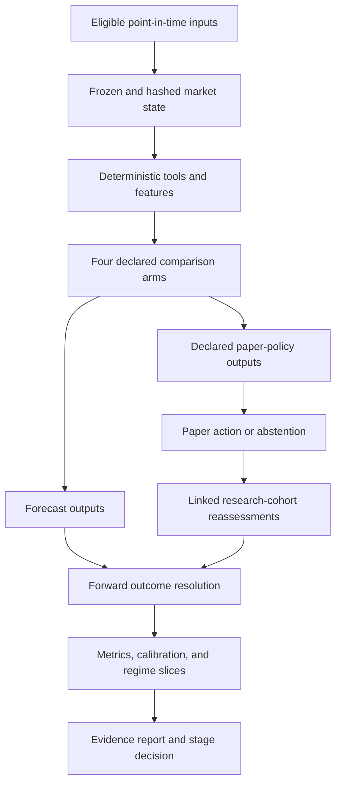
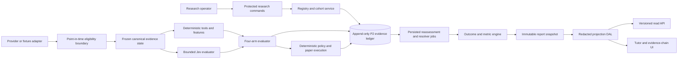
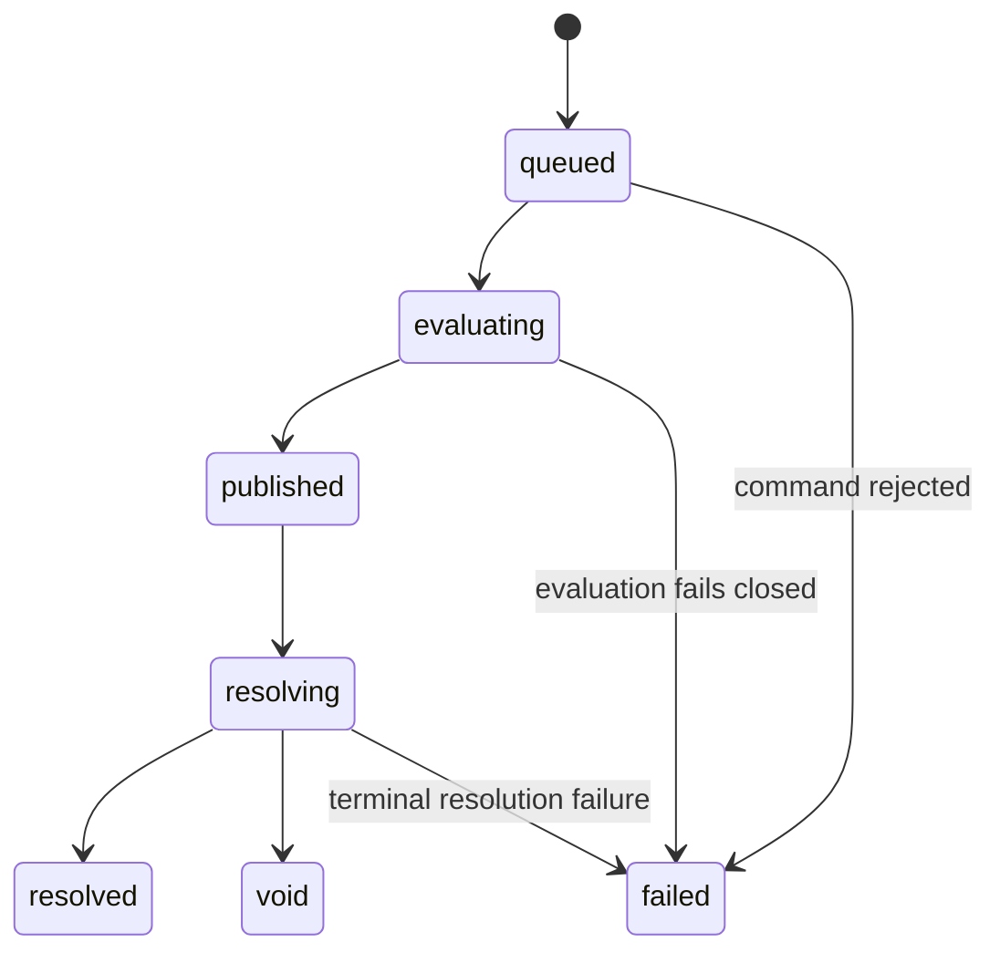
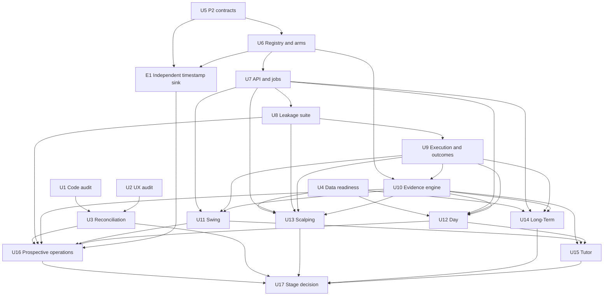

# Jev Trade Evidence Lab - Plan

## Goal Capsule

**Objective:** Establish credible, reproducible evidence about when Jev improves market judgment while giving learners a transparent simulation in which every recommendation can be examined against its inputs, controls, baselines, and realized outcome.

**Product authority:** [`GOAL.md`](../../GOAL.md) defines the active Phase Two contract. [`VISION.md`](../../VISION.md) defines the durable product direction. The v0.1.0 contract remains authoritative for shipped prototype behavior unless this plan explicitly changes it.

**Artifact scope:** This unified plan contains the Product Contract and the implementation-ready Planning Contract. Implementers may execute its units in dependency order, but may not bypass a named activation or evidence gate.

**Open blockers:** None block fixture-safe implementation. Live pack activation remains gated by recorded market-data rights and pack-specific data readiness. Long-term evidence will mature after the v0.2.0 software release because its outcome horizon is measured in months.

## Product Contract

### Summary

Phase Two validates the released prototype independently and adds a simulation-only predictor and experiment platform for four trading horizons. It measures Jev's incremental value against equivalent standard-tool and naive baselines, then publishes evidence with enough context to support `GO`, `ADJUST`, `STOP`, or `NOT ENOUGH EVIDENCE`.

### Problem Frame

The v0.1.0 prototype proves that a Jev judgment can be frozen, governed by deterministic policy, displayed transparently, and scored later. It does not yet establish whether Jev improves decisions, whether the interface survives independent review, or whether the method generalizes across trading horizons.

An isolated accuracy number would answer the wrong question. A useful evaluation must prevent look-ahead leakage, model realistic execution costs, preserve abstentions and failures, and compare equivalent information across methods. It must also distinguish a good forecast from a safe position and a profitable simulated policy.

Phase Two therefore treats prediction as a lifecycle of evidence rather than a stream of tips. Historical replay helps debug the method. Prospectively frozen decisions provide the credible record.

### Key Decisions

- **Evidence quality outranks peak accuracy.** (session-settled: user-approved — chosen over promoting a spectacular isolated accuracy result: a fragile claim cannot support durable trust.) Governs P2-R11, P2-R38-P2-R45, P2-R56.
- **Validation and predictor development proceed as coordinated parallel tracks.** (session-settled: user-directed — chosen over serial delivery: independent review can expose defects while the shared evidence contracts are being planned.) Governs P2-R1-P2-R5, P2-R50.
- **All four packs share one evidence contract and activate in a data-aware order.** (session-settled: user-approved — chosen over four disconnected products: comparable records and metrics are essential.) Governs P2-R24-P2-R36.
- **Day and Swing activate before Scalping, while the Long-Term cohort starts when point-in-time fundamentals are ready.** (session-settled: user-approved — chosen over activating every pack simultaneously: data cost, latency realism, and outcome maturity differ materially.) Governs P2-R32-P2-R36, P2-R52.
- **Jev judges; deterministic code calculates and acts.** (session-settled: user-approved — chosen over delegating indicators, sizing, fills, and scoring to the model: numerical authority must remain reproducible.) Governs P2-R17-P2-R23.
- **Historical replay is exploratory and prospective evidence is authoritative.** (session-settled: user-approved — chosen over treating optimized backtests as proof: prospective cohorts better resist leakage and selection bias.) Governs P2-R10-P2-R12, P2-R40-P2-R45.
- **Every reassessment is a new linked decision.** (session-settled: user-approved — chosen over mutating the current forecast: the sequence of changing judgments is itself evidence.) Governs P2-R8, P2-R29, P2-R39.
- **Short-term packs may simulate long and short positions.** (session-settled: user-directed — chosen over carrying the v0.1.0 long-only restriction into Phase Two: the founder explicitly requested long and short decisions for short-term packs.) Governs P2-R18, P2-R19, P2-R33-P2-R35, P2-R37.
- **Learner-triggered paper automation remains behind the evidence gate.** (session-settled: user-approved — chosen over shipping automation inside the Evidence Lab: the agreed product ladder places it after the tutor and predictor evidence stages.) Governs P2-R49, P2-R55, P2-R56.
- **Phase Two remains simulation-only.** (session-settled: user-approved — chosen over connecting a broker before efficacy and safety are demonstrated.) Governs P2-R47-P2-R49, P2-R55.

### Evidence lifecycle



### Actors

- P2-A1. **Learner:** explores a market scenario, makes a blind or informed paper decision, and studies why Jev Trade acted.
- P2-A2. **Research operator:** configures eligible scenarios and cohorts, monitors runs, resolves data incidents, and publishes evidence.
- P2-A3. **Jev evaluator:** returns narrow typed judgments over a frozen evidence packet without calculating policy outputs.
- P2-A4. **Deterministic evaluator:** calculates indicators, baselines, policy actions, executions, outcomes, and metrics.
- P2-A5. **Independent reviewer:** tests product requirements, code, release evidence, responsive behavior, accessibility, and security without sharing implementation ownership.
- P2-A6. **Founder:** supplies human validation and decides the stage gate from the consolidated evidence.
- P2-A7. **API consumer:** requests permitted simulations and reads versioned predictions or reports without receiving hidden methodology or real-money execution.

### Requirements

**Independent validation and reconciliation**

- P2-R1. The independent review must evaluate the exact v0.1.0 release commit `c75b9aa26f8f13c337bfbdef4b3fba9c0922a4b9` and the deployed revision it identifies.
- P2-R2. The review must map every v0.1.0 requirement and key technical decision to `CONFIRMED`, `PARTIAL`, `VIOLATED`, or `NOT VERIFIABLE`, then test code and security controls, release evidence, reproducibility, responsive UI/UX, accessibility, and failure states from a clean checkout.
- P2-R3. Reviewers must have no authorship in the v0.1.0 work they judge and must not fix their own findings; each finding records `BLOCKER`, `MAJOR`, or `MINOR` severity, evidence, reproduction steps, affected requirement, proposed owner, and disposition.
- P2-R4. Human validation must use the same requirement map and may add observations, disagreements, and product priorities without overwriting independent findings.
- P2-R5. A reconciliation report must preserve reviewer and founder observations and resolve every material finding as fixed and independently reverified, accepted with rationale, deferred with an owner and target, or invalid with counter-evidence.

**Experimental integrity and provenance**

- P2-R6. Every prediction must bind an immutable cutoff, eligible source timestamps, normalized inputs, input hashes, pack and horizon, model identifier, prompt version, feature version, policy version, and build version.
- P2-R7. No arm may receive a value that was unavailable at the prediction cutoff; publication time, effective time, ingestion time, and correction time must remain distinguishable.
- P2-R8. Published predictions, reassessments, actions, corrections, and outcomes must be append-only and linked; correction records may supersede a value but may not erase it.
- P2-R9. Equivalent arms in one experiment must receive the same eligible frozen state and cutoff, with arm-specific transformations declared before scoring.
- P2-R10. Historical replays must be visibly labeled exploratory and separated from prospective cohorts in storage, APIs, reports, and public language.
- P2-R11. A prospective experiment registry must freeze cohort eligibility, horizons, outcome bands, costs, exclusions, void rules, primary metrics, minimum evidence, and stop rules before its first forecast; a later change creates a new versioned cohort.
- P2-R12. Halts, delistings, missing data, provider failures, abstentions, invalid responses, voids, and corporate actions must remain visible in coverage and sensitivity reporting.
- P2-R13. A frozen run must reproduce its deterministic features, actions, and scores from stored records without calling Jev or a market provider again.
- P2-R14. A report must identify every version boundary that prevents valid aggregation and must never silently pool incompatible cohorts.

**Judgment, risk, and policy boundaries**

- P2-R15. Standard indicators and strategy markers must be calculated by versioned deterministic code from eligible normalized inputs.
- P2-R16. Jev must receive a bounded evidence packet containing structured values and attributed factual summaries; untrusted market or news text must never become executable instructions.
- P2-R17. Jev outputs must conform to a strict versioned schema with a permitted action vocabulary, normalized directional distribution, confidence or uncertainty, bounded rationale, and cited evidence identifiers.
- P2-R18. Code alone must calculate arithmetic, market sessions, indicators, thresholds, risk bands, position size, stops, targets, fees, slippage, fills, borrow availability and cost, short-sale constraints, P&L, and scores.
- P2-R19. A deterministic policy must translate judgment and measured market risk into `OPEN_LONG`, `OPEN_SHORT`, `HOLD`, `REDUCE`, `CLOSE`, or `WAIT` for short-term packs and `BUY`, `HOLD`, `REDUCE`, `EXIT`, or `WAIT` for Long-Term.
- P2-R20. The complete Jev distribution, deterministic market-risk estimate, and planned position loss must remain separate concepts in records and user-facing explanations.
- P2-R21. Abstention must be a first-class result. Coverage and missed-opportunity effects must accompany performance metrics.
- P2-R22. Invalid or late model responses must fail closed into an explicit unavailable or abstain state and must not be repaired after the outcome is visible.
- P2-R23. Each scheduled or event-driven reassessment must create a new decision linked to its predecessor and state what changed in the eligible evidence.

**Prediction, experiment, and evidence interfaces**

- P2-R24. The Prediction interface must create and retrieve versioned judgments, policy actions, evidence references, lifecycle state, and safe failure details.
- P2-R25. The Experiment interface must define packs, assets, horizons, arms, cohorts, replay or prospective mode, cost assumptions, and scheduled or event-driven reassessment rules.
- P2-R26. The Evidence interface must retrieve resolved outcomes, aggregate scorecards, cohort comparisons, calibration data, methodology, and report provenance.
- P2-R27. Creation requests must be idempotent, and repeated reads of a frozen record must return the same public representation for the same API version.
- P2-R28. Long-running work must expose explicit queued, evaluating, published, resolving, resolved, void, and failed states rather than keeping a request open indefinitely.
- P2-R29. Interface responses must expose enough version and evidence metadata to audit a result while redacting secrets, private operator data, prompts containing protected material, and licensed raw payloads.
- P2-R30. Public API behavior must be versioned. Breaking schema or methodology changes require a new version boundary and changelog entry.
- P2-R31. Research controls that can activate horizons or alter future cohorts, eligibility, budgets, or public reports must require operator authority and leave an immutable audit event; a cohort becomes immutable after its first forecast.

**Four pack contracts**

- P2-R32. Every pack must use the shared lifecycle in P2-R6-P2-R14 and the shared interfaces in P2-R24-P2-R31 while declaring its own input, horizon, action, cost, baseline, and resolution profile.
- P2-R33. **Scalping** must cover 10-second to 5-minute horizons with tick or Level 2 inputs, spread, depth, latency, fees, slippage, missed fills, adverse selection, and short availability; activation requires rights and timestamp precision adequate to support those claims.
- P2-R34. **Day Trading** must cover 15-minute to 4-hour horizons, close positions before the relevant market session ends, and support deterministic ORB, VWAP, RSI, MACD, volume, declared economic-event markers, and short borrow or locate failure.
- P2-R35. **Swing Trading** must cover 2-day to 3-week horizons with 4-hour or daily evidence, support and resistance, versioned pattern features, declared fundamental events, overnight gaps, corporate actions, and time-dependent short borrow cost.
- P2-R36. **Long-Term Investing** must cover horizons of 180 days or more with point-in-time financial statements, valuation and quality measures, sector context, dividends, splits, restatements, and DCA or value baselines.
- P2-R37. Jev stances must match the pack: Scalping, Day, and Swing may return `LONG`, `SHORT`, or `WAIT`; Long-Term may return `ACCUMULATE`, `MAINTAIN`, `DEACCUMULATE`, or `WAIT`.
- P2-R38. When a pack exposes a standard risk window, multi-horizon reports must keep the probability of price direction separate from the probability and magnitude of an adverse move over the declared next-hour, half-day, next-day, and next-week windows.

**Outcome resolution and evidence**

- P2-R39. Outcome resolution must use the first eligible forward observation under a versioned rule and preserve unresolved, unavailable, adjusted, void, and resolved states.
- P2-R40. Forecast scorecards must report sample size, coverage, class balance, hit rate, multiclass Brier score, log loss, and calibration; arms with a declared paper policy must also report net simulated return after costs, drawdown, turnover, and holding time.
- P2-R41. Trading-policy reports must add expectancy and profit factor, while Sharpe or Sortino remain hidden until the P2-R45 floor and the cluster-effective sample both pass.
- P2-R42. Evidence must compare four declared arms under the metric applicability contract below: deterministic standard tools, Jev on the same frozen inputs, full Jev Trade policy, and pack-appropriate naive controls.
- P2-R43. Reports must support slices by pack, asset, horizon, market regime, cohort, model version, prompt version, feature version, policy version, and build version without hiding the unsliced result.
- P2-R44. Comparisons must include cluster-aware uncertainty intervals where predictions overlap in asset or time, disclose effective sample size, and control the promoted claim set when multiple horizons or metrics are tested; a small sample must be labeled inconclusive.
- P2-R45. A performance claim for one pack requires at least 100 resolved prospective forecasts across at least 20 eligible symbols, at least 20 resolved forecasts in every promoted horizon, and at least 20 distinct resolution clusters or market sessions; the raw and effective samples and low-sample warning remain visible.
- P2-R46. Public evidence must include methodology, evaluation dates, eligibility and exclusion rules, cost assumptions, data limitations, sample and coverage, baselines, revisions, and known incidents beside any accuracy or return measure.

**Tutor and research-cohort experience**

- P2-R47. A learner must be able to inspect the standard signals, Jev judgment, deterministic risk assessment, paper action, later revisions, realized outcome, and scoring contribution as distinct layers.
- P2-R48. A learner must be able to run or join a permitted scenario, choose a blind or informed paper position, and compare that decision with every experiment arm after publication.
- P2-R49. Phase Two may schedule simulated research-cohort reassessments under operator controls, but it must not expose learner-triggered paper automation.
- P2-R50. The v0.1.0 experience and all new learner and operator paths must pass independent responsive, keyboard, focus, contrast, reduced-motion, loading, empty, and error-state validation.

**Operations, release, and stage control**

- P2-R51. Pack cadence must be event-driven or scheduled at a frequency the runtime and data source can support honestly; the system must measure decision latency and missed evaluations rather than imply continuous coverage.
- P2-R52. A pack may enter live prospective mode only after its provider-rights record, source health, timestamp semantics, retention rules, cost model, and outcome resolver pass a readiness gate.
- P2-R53. Operations must expose safe health, queue age, provider failures, invalid judgments, resolver backlog, latency, and cohort completeness without logging secrets or licensed raw payloads.
- P2-R54. Each completed issue merged to the release branch must advance a monotonic prerelease build version and add a changelog entry traceable to that issue.
- P2-R55. Phase Two must not connect to a broker, accept deposits, execute real orders, recommend personalized allocation, imply guaranteed returns, or market backtest results as prospective proof.
- P2-R56. The final evidence review must reconcile independent and human validation, data readiness, prospective results, costs, calibration, drawdown, reliability, and incidents into an explicit **GO**, **ADJUST**, or **STOP** decision for each proposed next stage; an evidence-deficient horizon must read **NOT ENOUGH EVIDENCE**, never **GO**.

**Evidence hardening**

- P2-R57. A prospective forecast batch is authoritative only when an independent timestamp receipt binds its publication-root hash before the earliest evaluated outcome can be observed; missing or late receipts remain visible and are excluded from authoritative prospective claims.
- P2-R58. Each pack must preregister evidence-grounded base and adverse execution-cost scenarios. Reports must show applicable policy results under both, and a policy-performance `GO` must be withheld or narrowed when its promoted conclusion reverses under the adverse scenario.

### Arm and action contracts

| Arm            | Frozen inputs and transformation                                                                                                                                                       | Output                                                     | Applicable primary metrics                     |
| -------------- | -------------------------------------------------------------------------------------------------------------------------------------------------------------------------------------- | ---------------------------------------------------------- | ---------------------------------------------- |
| Standard tools | Canonical state transformed only by preregistered deterministic indicators and signal rules, then passed through the same policy, risk, execution, and cost versions as Full Jev Trade | Forecast distribution plus governed paper action           | Forecast metrics and paper-policy metrics      |
| Jev            | The same canonical state represented by the versioned Jev evidence packet                                                                                                              | Typed forecast distribution and stance; no paper execution | Forecast metrics only                          |
| Full Jev Trade | Jev output passed through the shared deterministic market-risk, position-risk, policy, execution, and cost versions                                                                    | Forecast distribution plus governed paper action           | Forecast metrics and paper-policy metrics      |
| Naive controls | The same eligible cutoff data with a preregistered pack-specific rule such as majority class, seeded random, or passive exposure                                                       | Forecast or paper action as declared before the cohort     | Only metrics defined for that control's output |

The Jev-only arm never receives an implied trading policy. The primary incremental-Jev policy comparison holds the downstream risk, policy, execution, and cost stack constant between Standard tools and Full Jev Trade; only the forecast or stance source changes. A comparison that also changes downstream policy is labeled a product-bundle comparison and cannot be presented as Jev's isolated effect. Policy-performance comparisons use the standard-tools, full Jev Trade, and applicable naive-policy arms. Forecast-quality comparisons use every arm that emits a distribution.

| Pack                 | Jev stance                                       | Deterministic policy action                                  | Simulated execution                                                           |
| -------------------- | ------------------------------------------------ | ------------------------------------------------------------ | ----------------------------------------------------------------------------- |
| Scalping, Day, Swing | `LONG`, `SHORT`, `WAIT`                          | `OPEN_LONG`, `OPEN_SHORT`, `HOLD`, `REDUCE`, `CLOSE`, `WAIT` | Long buy or sell; short locate and sell or fail closed; later reduce or close |
| Long-Term            | `ACCUMULATE`, `MAINTAIN`, `DEACCUMULATE`, `WAIT` | `BUY`, `HOLD`, `REDUCE`, `EXIT`, `WAIT`                      | Long-only accumulation, reduction, or exit                                    |

`REDUCE` is a policy action, not a direction. A short stance cannot create an execution until the deterministic short-availability and cost model passes.

### Key Flows

- P2-F1. **Validate the released prototype.** **Actors:** P2-A5, P2-A6. **Steps:** Verify the frozen commit and deployment, run the requirement-based code and UI review, collect human observations, and reconcile every material finding. **Outcome:** One evidence-backed validation report. **Covers P2-R1-P2-R5, P2-R50.**
- P2-F2. **Publish a prospective prediction.** **Actors:** P2-A2-P2-A4. **Steps:** Establish cutoff, admit eligible point-in-time inputs, freeze and hash the state, calculate features, evaluate all arms, apply the shared downstream policy stack where applicable, publish the immutable records, and bind the batch root to a timely independent timestamp receipt. **Outcome:** Comparable predictions with auditable provenance and externally provable chronology. **Covers P2-R6-P2-R31, P2-R57.**
- P2-F3. **Reassess a research-cohort paper position.** **Actors:** P2-A2-P2-A4. **Steps:** Trigger the pack cadence, freeze only newly eligible evidence, issue a linked judgment, apply deterministic risk and execution rules, and publish the next paper action. **Outcome:** A complete sequence of decisions rather than a rewritten opinion. **Covers P2-R19-P2-R23, P2-R49, P2-R51.**
- P2-F4. **Resolve and score outcomes.** **Actors:** P2-A2, P2-A4. **Steps:** Detect horizon maturity, select the first eligible forward observation, apply adjustment and void rules, calculate arm and policy metrics, and retain failures and exclusions. **Outcome:** Reproducible resolved evidence. **Covers P2-R39-P2-R45.**
- P2-F5. **Teach from a scenario.** **Actors:** P2-A1. **Steps:** Make a blind or informed choice, inspect the separated evidence layers, follow reassessments, reveal outcomes, and compare the decision with all arms. **Outcome:** The learner sees judgment quality and risk discipline together. **Covers P2-R20, P2-R47, P2-R48.**
- P2-F6. **Decide the next stage.** **Actors:** P2-A2, P2-A5, P2-A6. **Steps:** Confirm readiness, attestation, and sample gates; review complete scorecards, base/adverse cost sensitivity, and incidents; record dissent; and issue a per-stage decision. **Outcome:** Expansion follows evidence rather than enthusiasm and a cost-fragile conclusion cannot become an unqualified claim. **Covers P2-R45, P2-R46, P2-R52-P2-R58.**

### Acceptance Examples

- P2-AE1. **Given** a filing restated after a forecast cutoff, **when** the forecast is replayed, **then** the original point-in-time filing remains the eligible input and the restatement appears only as a later correction event. **Covers P2-R7, P2-R8, P2-R13.**
- P2-AE2. **Given** the same frozen Day Trading state, **when** the four experiment arms run, **then** every arm receives the same eligible cutoff data, the Jev-only arm receives no implied paper policy, and the report applies only the metrics defined for each output. **Covers P2-R9, P2-R25, P2-R40, P2-R42.**
- P2-AE3. **Given** Jev returns probabilities that do not normalize within the schema tolerance, **when** policy evaluation begins, **then** the result fails closed as invalid or abstain and no post-outcome repair is permitted. **Covers P2-R17, P2-R21, P2-R22.**
- P2-AE4. **Given** a Swing position is reassessed after an earnings release, **when** the new decision publishes, **then** the original decision remains unchanged and the successor cites the newly eligible event and its predecessor. **Covers P2-R8, P2-R23, P2-R35.**
- P2-AE5. **Given** Scalping data lacks reliable exchange timestamps or depth-display rights, **when** an operator requests live prospective activation, **then** the readiness gate refuses activation while synthetic or licensed replay remains available and clearly labeled. **Covers P2-R33, P2-R52.**
- P2-AE6. **Given** a Day position remains open near the session boundary, **when** the pack's close rule triggers, **then** deterministic policy publishes an exit using the declared execution model and records any missed or partial simulated fill. **Covers P2-R18, P2-R19, P2-R34.**
- P2-AE7. **Given** a security is halted or delisted before outcome maturity, **when** resolution runs, **then** the event remains in cohort coverage and resolves or voids under the predeclared rule rather than disappearing. **Covers P2-R11, P2-R12, P2-R39.**
- P2-AE8. **Given** one pack has not passed its raw and effective prospective evidence floors, **when** its scorecard is viewed, **then** it shows all valid metrics and baselines with an inconclusive low-sample warning and a `NOT ENOUGH EVIDENCE` state. **Covers P2-R40-P2-R46, P2-R56.**
- P2-AE9. **Given** two reports span an incompatible policy version change, **when** an aggregate is requested, **then** the system separates the cohorts or explicitly rejects the aggregation. **Covers P2-R14, P2-R30, P2-R43.**
- P2-AE10. **Given** an operator schedules a prospective research cohort, **when** a reassessment changes a paper action, **then** the system publishes a linked decision and complete policy trace while exposing no learner-triggered automation control. **Covers P2-R23, P2-R49, P2-R51.**
- P2-AE11. **Given** an independent reviewer and the founder disagree on a UI finding, **when** reconciliation occurs, **then** both observations remain cited, neither reviewer edits the judged implementation, and the final disposition records the deciding evidence and rationale. **Covers P2-R3-P2-R5.**
- P2-AE12. **Given** the full Jev Trade arm beats a naive control in hit rate but loses after costs and drawdown, **when** the final review meets, **then** the decision uses the complete evidence and cannot advertise the isolated hit rate as success. **Covers P2-R40-P2-R46, P2-R56.**
- P2-AE13. **Given** a prospective batch receipt is missing, late, or does not bind the published root, **when** an authoritative report is built, **then** the affected rows remain visible as unattested coverage but are excluded from prospective claims. **Covers P2-R10, P2-R13, P2-R45, P2-R46, P2-R57.**
- P2-AE14. **Given** a paper-policy conclusion passes under base costs but reverses under the preregistered adverse-cost scenario, **when** its decision is rendered, **then** an unqualified policy-performance `GO` is withheld or narrowed and both results remain visible. **Covers P2-R40-P2-R46, P2-R56, P2-R58.**
- P2-AE15. **Given** Standard tools and Full Jev Trade receive the same frozen state, **when** the primary incremental-Jev policy comparison runs, **then** both use identical downstream risk, policy, execution, and cost versions; any comparison that changes those versions is labeled as a product-bundle view. **Covers P2-R9, P2-R14, P2-R25, P2-R42, P2-R58.**

### Success Criteria

- The independent validation can reproduce the deployed v0.1.0 revision and produces no unowned material finding.
- A frozen scenario can be replayed into identical deterministic features, paper actions, outcomes, and scores without external calls.
- Automated invariants detect future-data leakage, cross-arm input mismatch, mutation of published evidence, incompatible cohort pooling, and incomplete scorecards.
- Authoritative prospective rows carry timely independent timestamp receipts, and the primary policy comparison isolates the signal source under shared downstream policy and execution versions.
- Day and Swing run end to end on fixtures or licensed replay and have preregistered cohorts ready for prospective activation; a missing live-data gate may yield `NOT ENOUGH EVIDENCE` without blocking the software release.
- Scalping and Long-Term have executable shared contracts and explicit readiness evidence even if data rights or outcome maturity delay their live evidence.
- Every published report contains the four arms, full metric family, sample and coverage, uncertainty, methodology version, and visible limitations.
- Applicable policy reports include preregistered base and adverse execution-cost scenarios, and fragile conclusions remain visibly qualified.
- The product can state what is known, what remains inconclusive, and why a next-stage decision was made without relying on an isolated accuracy or return figure.

### Scope Boundaries

**Included in Phase Two**

- Independent code, release, responsive UI/UX, accessibility, and security validation of v0.1.0.
- A shared simulation and evidence contract for all four packs.
- Predictor, experiment, and evidence interfaces for research and controlled consumers.
- Historical replay, prospective cohorts, paper actions, outcome resolution, baseline comparisons, and evidence reports.
- Tutor explanations and operator-run research-cohort scheduling.

**Deferred for later**

- A hardened public SaaS commercial surface, billing, customer tenancy, and service-level commitments.
- Personalized portfolio construction or suitability workflows.
- Native mobile applications and exchange-specific production co-location.
- Learner-triggered paper automation, including start, pause, or stop controls for an autonomous policy.
- Any public efficacy claim that has not passed P2-R45 and P2-R46.

**Outside this phase's identity**

- Brokerage connectivity, deposits, custody, and real-money execution.
- Guaranteed-return language, hidden signal selling, or recommendations presented without methods and outcomes.
- Retrospective selection of favorable symbols, horizons, or periods after outcomes are known.

### Dependencies and Assumptions

- The v0.1.0 release at `c75b9aa26f8f13c337bfbdef4b3fba9c0922a4b9` remains available as the audit target.
- Provider selection and public display remain governed by `docs/research/market-data-provider-decision.md` and `docs/operations/public-mode-gate.md`.
- Jev transport remains governed by `docs/research/jev-openrouter-integration.md` until a separately reviewed decision replaces it.
- Point-in-time fundamentals, tick or Level 2 history, and economic-event data may require different licensed providers.
- A long-term cohort can launch in software before its 180-day outcomes mature; its evidence cannot be accelerated by substituting an optimized historical result.
- Pack activation follows evidence readiness rather than roadmap order alone.

### Outstanding Questions

**Deferred to planning**

- Which licensed providers best satisfy each pack's timestamp, retention, display, and onward-processing requirements? Planning must keep fixture work independent while preventing live activation before this resolves.
- Which exact neutral-return bands and risk thresholds should each horizon use in policy v2? Training-only research inside the corresponding pack unit must freeze and cold-review these values before policy or scoring implementation starts.
- Which runtime should host sub-minute event processing if Scalping passes its data-readiness gate? Planning may keep Scalping fixture and replay work runtime-neutral until then.
- Which API capabilities belong in the authenticated research release and which wait for the public SaaS release? Planning must freeze the research boundary before implementing public routes.

### Sources / Research

- `GOAL.md`
- `docs/plans/2026-09-19-1020-feature-jev-trade-prototype-plan.md`
- `docs/research/jev-openrouter-integration.md`
- `docs/research/market-data-provider-decision.md`
- `docs/research/trading-product-ui.md`
- `docs/operations/public-mode-gate.md`

## Planning Contract

### Key Technical Decisions

- KTD1. **Phase Two is an additive Evidence Lab beside the frozen v0.1 surfaces.** Add versioned P2 tables, modules, routes, and projections. Keep the v0.1 ledger, long-only portfolio rules, fixtures, and public routes readable and replayable; migrations may expand the schema but may not reinterpret old records. Governs P2-R1, P2-R6-P2-R14, P2-R30, P2-R54.
- KTD2. **The implementation remains a modular Next.js monolith.** Add `modules/evidence-lab/` and reuse the existing canonical JSON, hashing, normalized market state, bounded Jev transport, queue, and scorecard primitives where their contracts match. A service split requires measured runtime evidence and a new decision. Governs P2-R13, P2-R24-P2-R30, P2-R51-P2-R53.
- KTD3. **Every methodology input is a content-addressed registry entry.** Pack, feature, prompt, model, policy, execution, outcome, baseline, metric, and cohort manifests use canonical JSON and immutable hashes. Registry state advances through append-only approval events; the first cohort forecast locks its exact tuple. Governs P2-R6, P2-R11, P2-R14, P2-R30, P2-R31.
- KTD4. **One eligible state fans out to all arms and the primary policy comparison changes only the signal source.** A run freezes one canonical evidence state. Deterministic and naive transforms derive from that state; one bounded Jev artifact is referenced by both the Jev-only and Full Jev Trade arms so model-call variation cannot become an arm difference. Standard tools and Full Jev Trade use the same deterministic risk, policy, execution, and cost versions for the primary policy comparison. The Jev-only arm has `policyApplicability: NOT_APPLICABLE`. Governs P2-R9, P2-R17-P2-R22, P2-R42.
- KTD5. **Predictions and corrections form an append-only graph.** Reassessment, repair, source correction, outcome correction, and report replacement append successors with typed predecessor links. Public projections may point to the active successor but never erase prior nodes. Governs P2-R8, P2-R13, P2-R23, P2-R39.
- KTD6. **Operator commands and consumer reads have separate API boundaries.** Protected `/api/internal/research/v2/*` routes own creation, scheduling, activation, correction, and publication. Versioned `/api/v2/*` routes expose explicit redacted DTOs and remain disabled for public consumers until rights and public-mode gates pass. The first research release has no customer tenancy, billing, learner automation, or customer-write API. Governs P2-R24-P2-R31, P2-R47-P2-R49, P2-R55.
- KTD7. **Database uniqueness and canonical request hashes enforce idempotency.** Each command supplies an idempotency key. A repeated key returns the existing immutable result only when the canonical request hash matches; a different payload returns a conflict. Run identity binds cohort, arm set, symbol, cutoff, decision kind, and registry tuple. Governs P2-R6, P2-R27, P2-R31.
- KTD8. **Long-running evaluation uses persisted operations with bounded workers.** A run advances `queued → evaluating → published → resolving → resolved|void`; `queued`, `evaluating`, or `resolving` may instead reach `failed` with a recorded failure phase. Retriable worker attempts have their own queued, running, succeeded, and failed lifecycle and never rewrite the run's evidence. Existing Vercel/Node route and cron patterns may claim bounded EOD, fixture, replay, and resolution work. Sub-minute prospective processing requires the Scalping readiness decision and an external event worker; the web request never waits for it. Governs P2-R28, P2-R33, P2-R51-P2-R53.
- KTD9. **Phase Two execution uses a separate signed-position ledger.** Do not loosen the v0.1 portfolio invariant that rejects negative shares. P2 records long and short paper positions, locate result, borrow rate and accrual, spread, slippage, latency, partial or failed fill, forced close, and close reason. Missing short availability fails closed. Governs P2-R18, P2-R19, P2-R33-P2-R35, P2-R40.
- KTD10. **Reports aggregate only a declared compatibility tuple.** The tuple includes pack, horizon, cohort, mode, model, prompt, feature, policy, execution, cost scenario, outcome, baseline, metric, and build versions. The incremental-Jev policy view additionally requires identical downstream policy, execution, and cost versions across its two arms. Incompatible rows yield separated series or a typed rejection. Statistical code owns confidence intervals, calibration, multiple-comparison controls, and sample gates. Governs P2-R14, P2-R40-P2-R46, P2-R58.
- KTD11. **Pack manifests carry the remaining exact methodology choices.** Each approved profile freezes horizons, neutral bands, eligibility, void rules, evidence-grounded base and adverse execution-cost scenarios, execution parameters, features, risk thresholds, arms, baselines, seeds, metrics, cluster definition, sample floor, cadence, budget, and stop rules. Values may be selected from training-only research at the start of the pack issue, then cold reviewed and hashed before policy or scoring implementation consumes them; outcomes from the evaluated replay or prospective cohort may not tune them. Governs P2-R11, P2-R32-P2-R45, P2-R52, P2-R58.
- KTD15. **Prospective chronology is externally attested.** Each prospective publication batch commits its root hash to an independent timestamp sink before the earliest evaluated outcome. The receipt, sink identity, deadline, status, and linked batch are immutable evidence. Missing or late receipts reduce verified coverage and cannot enter authoritative prospective claims. Governs P2-R10, P2-R13, P2-R45, P2-R46, P2-R57.
- KTD12. **Data readiness is a capability record, not a provider name embedded in code.** Adapters declare rights, timestamp semantics, retention, permitted transformations, display scope, health, and supported pack capabilities. Fixtures implement the same boundary. No provider purchase or live activation is implied by fixture-safe completion. Governs P2-R7, P2-R10, P2-R29, P2-R33-P2-R36, P2-R52.
- KTD13. **The tutor reads projections and never controls a cohort.** Server-only data access produces learner DTOs that separate tools, Jev judgment, market risk, position risk, policy, revisions, outcomes, and score contribution. The UI represents loading, empty, stale, failed, void, unresolved, corrected, and resolved states without exposing an automation control. Governs P2-R20, P2-R47-P2-R50.
- KTD14. **One issue lands through one reviewed pull request and one serialized version increment.** The orchestrator assigns the next unused `0.2.0-alpha.N` after rebasing, updates `VERSION`, `package.json`, `CHANGELOG.md`, `ROADMAP.md`, and `STATUS.md`, and preserves a cold-review receipt when the issue requires one. Governs P2-R54, P2-R56.

### High-Level Design



The write path creates evidence. The read path projects evidence. Route handlers must not return database rows, raw licensed payloads, prompts, request headers, provider metadata that violates rights, or private operator identity.



A terminal failure remains evidence. Retry creates an operation attempt tied to the same command and does not overwrite a published decision. Reassessment and correction are separate evidence nodes linked under KTD5; `superseded` is a projection relation, not a run-lifecycle state.

### Repository Structure

```text
config/evidence-lab/
  registry/schema-v1.json
  pack-profiles/{scalping,day,swing,long-term}/v1.json
  cohorts/<cohort-id>.json

db/
  migrations/0002_evidence_lab_registry.up.sql
  migrations/0003_evidence_lab_runs.up.sql
  migrations/0004_evidence_lab_execution_outcomes.up.sql
  migrations/0005_evidence_lab_projections_reports.up.sql
  schema/evidence-lab.ts

modules/evidence-lab/
  contracts.ts
  registry/
  state/
  arms/
  invariants/
  policy/
  execution/
  positions/
  outcomes/
  metrics/
  reports/
  projections/
  operations/
  packs/{scalping,day,swing,long-term}/
  api/

app/
  api/internal/research/v2/
  api/v2/{predictions,experiments,evidence,reports}/
  lab/[pack]/[runId]/
  methodology/evidence-lab/

components/evidence-lab/
tests/fixtures/evidence-lab/
tests/integration/evidence-lab-*.test.ts
tests/e2e/evidence-lab-*.spec.ts
docs/{reviews,research,evidence,methodology,operations}/
```

These are intended ownership boundaries. An implementation unit may choose a nearby filename that better matches an established repository pattern, but it must keep the boundary and update this plan if the change affects another unit.

### Storage and Event Model

The first migration adds registry, cohort, source-revision, and evidence-state records in U5. The second adds run, run-event, Jev-artifact, and arm-output records in U6. The third adds execution, position, and outcome records in U9. The fourth adds rebuildable projections and report snapshots in U10. Each immutable row carries a ULID, `created_at`, canonical payload or typed columns plus canonical payload, content hash, applicable registry references, and disclosure class.

Core record families are:

- `p2_registry_entries` and `p2_registry_events` for immutable methodology objects and their approval, activation, and retirement events.
- `p2_cohorts` and `p2_cohort_events` for preregistration, future-dated activation, pause, closure, exclusions, and stop rules.
- `p2_source_revisions` for source identity, publication, effective, ingestion, correction, and availability timestamps.
- `p2_evidence_states` for one eligible normalized state and admission manifest per cutoff.
- `p2_runs` and `p2_run_events` for idempotency, mode, lifecycle, predecessor, timing, and failure evidence.
- `p2_jev_artifacts` and `p2_arm_outputs` for the shared bounded judgment and the four declared outputs.
- `p2_policy_decisions`, `p2_execution_events`, and `p2_position_events` for applicable simulated policies.
- `p2_outcomes` and `p2_outcome_events` for unresolved, unavailable, adjusted, void, resolved, and corrected results.
- `p2_report_snapshots` for query definition, compatibility tuple, result, evidence status, and reproducibility hash.
- `p2_publication_receipts` for independent timestamp sink, batch root, submission and receipt times, deadline, status, and receipt payload hash.
- `p2_operator_audit_events` plus persisted job records for privileged commands and bounded work.

Database constraints and service invariants must establish:

1. exactly one frozen evidence state per run;
2. exactly one output for each declared arm;
3. one evidence-state hash shared by all outputs;
4. no execution reference when policy applicability is `NOT_APPLICABLE`;
5. no admitted source with `available_at > cutoff_at`;
6. no mutation or deletion of evidence rows through application roles;
7. no reused idempotency key with a different request hash;
8. no promoted aggregate containing incompatible registry tuples; and
9. no prospective cohort mutation after its first published forecast.
10. no prospective record enters an authoritative projection without a timely receipt linked to its batch root.

The existing root-chain and content-hash primitives remain the canonical serialization foundation. P2 tables either participate in a versioned P2 root chain or extend the existing chain through a reviewed compatibility adapter; U5 settles that schema detail with a migration and replay proof.

### API and Authorization Boundary

The initial human command surface is operator-only:

- `POST /api/internal/research/v2/experiments` registers a draft cohort against approved registry entries.
- `POST /api/internal/research/v2/predictions` submits an idempotent fixture, replay, or authorized prospective run.
- `POST /api/internal/research/v2/cohorts/:id/events` appends future activation, pause, closure, or correction events.
- `GET /api/internal/research/v2/predictions/:id`, `/experiments/:id`, `/evidence/:id`, and `/reports/:id` retrieve protected research projections while the public surface is disabled.

The scheduler remains the existing `GET /api/internal/cron` route. Vercel Cron authenticates with `CRON_SECRET` plus the configured scheduler identity, and that handler claims bounded Phase Two work internally. It never accepts `OPERATOR_TOKEN`. Any future HQ or test-only claim endpoint requires a separate design decision and cannot be exposed as a public or operator-token route.

The initial read surface is versioned and projected:

- `GET /api/v2/predictions/:id` returns the safe decision graph and state.
- `GET /api/v2/experiments/:id` returns declared methodology and coverage.
- `GET /api/v2/evidence/:id` returns an outcome or evidence projection.
- `GET /api/v2/reports/:id` returns a frozen report and its compatibility and sample warnings.

Human command and protected research-read routes require operator authority, allowed origin, rate limits, and an audit event; commands additionally require idempotency checks. The scheduler route requires cron authority and scheduler identity. Public read routes remain capability-gated and can be disabled while protected research retrieval continues. All routes use Node runtime, asynchronous Next.js route parameters, server-only DAL modules, and explicit DTO schemas.

| Route class              | Accepted credential                                                                              | Required boundary                                                                                                                                                                 |
| ------------------------ | ------------------------------------------------------------------------------------------------ | --------------------------------------------------------------------------------------------------------------------------------------------------------------------------------- |
| Human research commands  | Dedicated `OPERATOR_TOKEN` over HTTPS                                                            | Reject the cron credential; bind the audit event to a non-secret token fingerprint; support immediate revocation by rotation; never store the token in browser storage or cookies |
| Protected research reads | Dedicated `OPERATOR_TOKEN` over HTTPS                                                            | Read explicit protected projection DTOs; reject the cron credential; redact licensed payloads, prompts, credentials, and internal headers                                         |
| Bounded scheduler claim  | Dedicated `CRON_SECRET` plus the configured scheduler identity                                   | Accept only on the existing `GET /api/internal/cron`; reject the operator credential and direct public calls; claim Phase Two work inside the handler                             |
| Public/read projection   | No privileged credential or a future consumer credential selected by a separate release decision | Read only rights-cleared DTOs through the projection DAL; no command or protected-payload access                                                                                  |

U7 tests every credential against every privileged route, including rejection of cross-use, missing identity, expired deployment configuration, and leaked-value redaction. The single-operator research release deliberately uses a rotatable operator token rather than adding customer identity or session infrastructure; a multi-user operator surface requires a new auth decision.

The P2 database privilege matrix is equally explicit:

- the public reader may select only rights-cleared redacted projection views;
- public ingest receives no research-ledger capability;
- the worker may execute only named run and event append procedures and required safe reads;
- the operator may execute only named registry, cohort, activation, correction, and publication procedures;
- no runtime role may read protected payload tables directly, mutate or delete evidence rows, assume migration ownership, or grant privileges; and
- the migration role remains separate and absent from runtime.

U5 replaces the v0.1 single runtime connection with purpose-specific server-only credentials (`OPERATOR_DATABASE_URL`, `WORKER_DATABASE_URL`, and `PUBLIC_DATABASE_URL`) owned by matching DAL modules. The migration credential remains available only to release tooling. No request credential selects or overrides a database role, and deployments fail closed when a required role-specific connection is absent.

### Pack Profiles and Activation Gates

The first profile manifests support these declared horizon sets while retaining the user-requested ranges:

| Pack      | Initial fixture/replay horizons        | Required execution semantics                                                                                 |
| --------- | -------------------------------------- | ------------------------------------------------------------------------------------------------------------ |
| Scalping  | 10s, 30s, 45s, 60s, 300s               | Tick/L2 ordering, spread, depth, latency, fees, slippage, missed fills, adverse selection, locate and borrow |
| Day       | 15m, 60m, 120m, 240m, session close    | Exchange calendar, ORB, VWAP, RSI, MACD, volume, event markers, locate, forced close                         |
| Swing     | 2, 5, 10, and 15 eligible trading days | 4h/daily state, gaps, patterns, events, corporate actions, time-dependent borrow                             |
| Long-Term | 180, 365, and 730 calendar days        | Point-in-time filings, restatements, dividends, splits, valuation, quality, DCA/value baselines              |

Risk projections may expose one-hour, half-day, one-day, and one-week windows where the pack and eligible data support them. A half-day is 12 hours for a continuously traded asset and half the declared regular-session duration for a session-traded asset; resolution uses the first eligible observation at or after that boundary. Directional probabilities, adverse-move probabilities, and planned position loss remain separate fields.

A manifest begins `DRAFT`, advances to `VALIDATED` after schema and deterministic fixture checks, to `APPROVED` after cold methodology review, and to `ACTIVE` only through a future-dated cohort event after the data-readiness receipt passes. Training-only research may select neutral bands and risk coefficients; the evaluated replay or prospective outcomes may not. The manifest stores the selection dataset boundary and resulting values.

### Runtime, Rollout, and Rollback

Fixture and replay work runs in the existing Node 22 application and test environment. Bounded EOD and resolver work uses the current persisted-job pattern on the web deployment. The HQ box may run controlled replay and validation jobs, but a successful HQ run does not imply that Vercel can honestly support sub-minute processing.

Release order is:

1. keep production on validated fixture behavior while U1-U10 establish audits and the shared spine;
2. deploy additive migrations and fixture/replay projections with all live capabilities disabled;
3. complete Swing and Day fixture/replay receipts and preregister cohorts;
4. activate a restricted prospective cohort only after its future-dated rights/readiness event;
5. treat Scalping and Long-Term independently, allowing `NOT ENOUGH EVIDENCE` without weakening their gates;
6. enable a public read projection only through the separate public-mode gate; and
7. retain learner automation outside v0.2.

Operational rollback pauses future scheduling, prevents new publication, and returns reads to the last validated projection or fixture deployment. Evidence rows, effective cutoffs, forecasts, and outcomes are never rolled back or rewritten. A schema rollback is allowed only before evidence is written; after that, recovery is forward-only.

### Sequencing



U1, U2, U4, and the fixture-safe slice of U5 may start in parallel. Each later unit starts only when its hard predecessors have landed. Live-semantics work in U5 and all pack activation remain conditional on U4. E1 is a separately tracked enabling card for the independent prospective timestamp sink; it blocks U16 activation, not fixture replay. The U8 contract and registry invariant slice may begin after U5-U6, while API/job-race cases wait for U7. The locale-independent Jev identity fix in #31 blocks the first real Jev call in U7.

## Implementation Units

### Unit Index

| Unit | One-line title                                      | Primary files                                                                          | Depends on       |
| ---- | --------------------------------------------------- | -------------------------------------------------------------------------------------- | ---------------- |
| U1   | Cold code, release, and security audit (#11)        | `docs/reviews/v0.1.0-code-release-security-audit.md`                                   | Program contract |
| U2   | Cold UI/UX and accessibility audit (#12)            | `docs/reviews/v0.1.0-ui-ux-accessibility-audit.md`                                     | Program contract |
| U3   | Validation reconciliation (#13)                     | `docs/reviews/v0.1.0-validation-reconciliation.md`                                     | U1, U2           |
| U4   | Data rights and pack-readiness matrix (#14)         | `docs/research/phase-two-data-readiness.md`                                            | Program contract |
| U5   | P2 contracts and immutable ledger spine (#15)       | `db/migrations/0002_*`, `modules/evidence-lab/{contracts,registry,state}/`             | Program contract |
| U6   | Experiment registry and four-arm equivalence (#16)  | `db/migrations/0003_*`, `config/evidence-lab/`, `modules/evidence-lab/arms/`           | U5               |
| U7   | Idempotent predictor jobs and APIs (#17)            | `app/api/internal/research/v2/`, `modules/evidence-lab/operations/`                    | U5, U6; #31 for real Jev calls |
| U8   | Temporal and adversarial invariant suite (#18)      | `modules/evidence-lab/invariants/`, `tests/fixtures/evidence-lab/adversarial/`         | U5-U7            |
| U9   | Policy, execution, reassessment, and outcomes (#19) | `db/migrations/0004_*`, `modules/evidence-lab/{policy,execution,outcomes,positions}/`  | U7, U8           |
| U10  | Calibration, statistics, and reports (#20)          | `db/migrations/0005_*`, `modules/evidence-lab/{metrics,reports}/`                      | U6, U9           |
| U11  | Swing pack end to end (#21)                         | `modules/evidence-lab/packs/swing/`                                                    | U7, U9, U10; U4 for prospective activation |
| U12  | Day pack end to end (#22)                           | `modules/evidence-lab/packs/day/`                                                      | U4, U7, U9, U10  |
| U13  | Scalping feasibility and activation decision (#23)  | `modules/evidence-lab/packs/scalping/`, `docs/evidence/scalping-readiness-decision.md` | U4, U7-U10       |
| U14  | Long-Term cohort (#24)                              | `modules/evidence-lab/packs/long-term/`                                                | U4, U7, U9, U10  |
| U15  | Tutor and evidence-chain UI (#25)                   | `app/lab/`, `components/evidence-lab/`                                                 | U10-U12          |
| U16  | Prospective cohort operations (#26)                 | `modules/evidence-lab/operations/`, `docs/operations/evidence-lab-cohorts.md`          | U3, U8, U10-U12, E1 |
| U17  | Consolidated stage decision (#27)                   | `docs/evidence/phase-two-consolidated-decision.md`                                     | U3, U10, U13-U16 |
| E1   | Independent timestamp sink and verifier (#30)      | `modules/evidence-lab/attestation/`, `docs/operations/`                                | U5, U6           |

### Requirement Closure Owners

Units may contribute a storage, contract, test, or evidence slice without claiming the whole requirement. The closure owner below is responsible for proving the complete behavior after its prerequisites land.

| Requirements                  | Closure owner                           | Required contributors                           |
| ----------------------------- | --------------------------------------- | ----------------------------------------------- |
| P2-R1-P2-R3                   | U1                                      | Program contract                                |
| P2-R4-P2-R5                   | U3                                      | U1, U2, founder validation                      |
| P2-R6-P2-R14, P2-R57          | U17 program audit                       | U5-U8, E1, U10, U16                             |
| P2-R15                        | U17 program audit                       | U6 and each pack slice in U11-U14               |
| P2-R16-P2-R17                 | U6                                      | U5                                              |
| P2-R18-P2-R23                 | U9                                      | U6-U8                                           |
| P2-R24-P2-R31                 | U7                                      | U5, U6                                          |
| P2-R32, P2-R37                | U17 program audit                       | U6 and each pack slice in U11-U14               |
| P2-R33                        | U13                                     | U4, U7-U10                                      |
| P2-R34                        | U12                                     | U4, U7, U9, U10                                 |
| P2-R35                        | U11                                     | U7, U9, U10                                     |
| P2-R36                        | U14                                     | U4, U7, U9, U10                                 |
| P2-R38, P2-R40-P2-R46, P2-R58 | U17 program audit                       | U10 engine slice and pack evidence from U11-U14 |
| P2-R39                        | U9                                      | U5-U8                                           |
| P2-R47-P2-R48                 | U15                                     | U10-U12                                         |
| P2-R49                        | U17 program audit                       | U15, U16                                        |
| P2-R50                        | U17 program audit                       | U2, U15, U16                                    |
| P2-R51-P2-R53, P2-R55         | U17 program audit                       | U3, U4, U8, U10-U16                             |
| P2-R54                        | Each merging unit; program audit in U17 | Release orchestrator                            |
| P2-R56                        | U17                                     | U3, U10, U13-U16                                |

### U1. Cold code, release, and security audit

**Goal:** Independently establish whether the exact v0.1.0 release satisfies its contract and whether its release evidence is reproducible.

**Requirements:** P2-R1-P2-R3 and the code, release, reproducibility, security, and deployed-revision portions of P2-R50.

**Dependencies:** The frozen tag and commit only. The reviewer must not author fixes.

**Files:** Add `docs/reviews/v0.1.0-code-release-security-audit.md` and `docs/reviews/v0.1.0-requirement-matrix.md`; do not modify product code.

**Approach:** Check out the tag in an isolated worktree, map every v0.1 R-ID and KTD to evidence, rerun the repository and deployment gates, test authorization and redaction boundaries, and record exact commands, artifacts, severities, and uncertainty.

**Test scenarios:** Clean install/build; fixture proof and ledger replay; database role and immutability probes; public write rejection; secret/header/log redaction; deployed commit/version/origin match; failure-path behavior.

**Verification:** Every v0.1 R-ID and KTD has one of the four required statuses; every material finding has reproduction evidence, owner proposal, and severity; the report includes reviewer identity/model, audited SHA, timestamps, and no self-authored fix.

### U2. Cold UI/UX, accessibility, and comprehension audit

**Goal:** Independently measure whether the released prototype explains its judgment and policy clearly across supported viewports and states.

**Requirements:** P2-R1-P2-R4 and the responsive, keyboard, focus, contrast, reduced-motion, loading, empty, and error portions of P2-R50.

**Dependencies:** The frozen deployment and commit. The reviewer must remain independent from U15 implementation.

**Files:** Add `docs/reviews/v0.1.0-ui-ux-accessibility-audit.md` and `docs/reviews/v0.1.0-ui-state-matrix.md`.

**Approach:** Audit the public journeys at 400, 768, and 1440 pixels; trace keyboard order and visible focus; inspect copy comprehension, evidence hierarchy, state transitions, overflow, motion preferences, and recovery behavior; retain screenshots or traces with stable references.

**Test scenarios:** Home, explore, stock, forecast, portfolio, scorecard, and methodology journeys; loading/empty/error/stale states; keyboard-only and reduced-motion; 200% zoom; color/contrast and non-color state signaling.

**Verification:** The report covers every route and required state, distinguishes defects from preferences, records severity and reproduction, and leaves findings unchanged for U3.

### U3. Validation reconciliation

**Goal:** Produce one disposition record without erasing independent findings or founder observations.

**Requirements:** P2-R4, P2-R5, P2-R50.

**Dependencies:** U1 and U2 reports plus founder validation.

**Files:** Add `docs/reviews/v0.1.0-validation-reconciliation.md`; update issue links, `ROADMAP.md`, and `STATUS.md`.

**Approach:** Join findings by requirement and affected surface, cite both sources, record agreement or dissent, and give each material item one disposition: fixed and independently reverified, accepted with rationale, deferred with owner/target, or invalid with counter-evidence. Open separate implementation cards for accepted fixes.

**Test scenarios:** Conflicting severity; duplicate findings; founder-only observation; reviewer finding rejected with evidence; blocker requiring release hold; fix that still needs cold reverification.

**Verification:** No material finding is missing or silently downgraded; every accepted fix has an owner and reverification path; both reports remain immutable references.

### U4. Data rights and pack-readiness matrix

**Goal:** Determine what can legally and technically run as fixture, replay, restricted prospective, and public evidence for each pack.

**Requirements:** P2-R7, P2-R10-P2-R12, P2-R29, P2-R32-P2-R36, P2-R46, P2-R52.

**Dependencies:** None beyond the Product Contract. Provider purchase is outside this unit.

**Files:** Add `docs/research/phase-two-data-readiness.md`, `docs/research/point-in-time-data-dictionary.md`, and source links or dated evidence receipts.

**Approach:** Evaluate candidate primary sources against field coverage, publication/effective/ingestion/correction timestamps, history, corporate actions, exchange/session semantics, redistribution, display, retention, derived-data, model-processing, audit, latency, quota, and cost terms. Trace short-borrow and locate assumptions, survivorship-free universe membership, and pack-specific runtime benchmarks. A conservative synthetic cost may support labeled fixture research but cannot masquerade as an observed locate or empirical short-execution result. Mark unknown terms as a hold; advertised pricing or permissions are not an executed grant.

**Test scenarios:** Free source lacking redistribution rights; adjusted-only history; late filing restatement; L2 feed without retention rights; economic event revised after publication; provider outage and correction.

**Verification:** Every required field has a source or fixture plan and a rights/readiness state; each pack has explicit fixture, replay, prospective, and public gates; claims link to authoritative provider or regulatory documentation.

### U5. P2 contracts and immutable ledger spine

**Goal:** Add the fixture-safe evidence grammar and append-only storage without changing v0.1 behavior.

**Requirements:** Own the storage and contract slice of P2-R6-P2-R14, P2-R54, and P2-R57 receipt records; supply prerequisites for P2-R17 and P2-R27-P2-R31. U7 owns the complete interface behavior and U17 owns final cross-unit invariant closure.

**Dependencies:** Program contract. U4 informs live source semantics but does not block schema and fixture work.

**Files:** Add `db/schema/evidence-lab.ts`, `db/migrations/0002_evidence_lab_registry.up.sql`, `modules/evidence-lab/contracts.ts`, `modules/evidence-lab/registry/`, `modules/evidence-lab/state/`, and `tests/db/evidence-lab-foundation.sql`; extend migration and database verification scripts.

**Approach:** Define Zod and TypeScript contracts first; add registry, cohort, source-revision, evidence-state, audit, and external publication-receipt records; reuse canonical serialization and content hashing; implement the Planning Contract's P2 database privilege matrix with named procedures and projection views; expose repositories behind interfaces.

**Test scenarios:** Valid registry hash; duplicate content; per-role permitted procedure; direct-table and cross-role denial; mutation/delete/grant denial; late source admission; correction chain; cohort lock after first forecast; migration on empty and v0.1 databases; v0.1 replay after migration.

**Verification:** Disposable PostgreSQL migration and SQL invariant suite pass; canonical hashes are stable; v0.1 unit, integration, and replay checks remain green; no prediction route or live activation is added in this unit.

### U6. Experiment registry and four-arm equivalence

**Goal:** Freeze cohorts and create comparable outputs from one evidence state.

**Requirements:** P2-R9, P2-R11, P2-R14-P2-R22, P2-R25, P2-R31, P2-R42, and the batch-binding slice of P2-R57.

**Dependencies:** U5.

**Files:** Add `db/migrations/0003_evidence_lab_runs.up.sql`, `config/evidence-lab/registry/schema-v1.json`, initial draft pack manifests, `modules/evidence-lab/arms/`, and cohort registry services; extend the migration manifest and database verifier.

**Approach:** Validate manifests into content-addressed entries; freeze seeds and arm transformations; create one Jev artifact and four typed arm outputs; bind each prospective run to its publication batch and receipt status; enforce output and metric applicability; require identical downstream policy, execution, and cost versions for the primary Standard-tools-versus-Full-Jev-Trade policy comparison; lock a cohort tuple on first publication.

**Test scenarios:** All arms share state hash; Jev artifact is reused; Jev-only policy is inapplicable; Standard tools and Full Jev Trade share downstream policy/execution/cost versions; seeded naive arm replays identically; incompatible manifest update creates a new cohort; missing declared arm or prospective batch binding fails closed.

**Verification:** Golden fixtures reproduce identical hashes; database constraints reject cross-state arms and Jev-only execution; registry approval receipts identify exact content hashes.

### U7. Idempotent predictor jobs and APIs

**Goal:** Submit, observe, and retrieve bounded research runs without holding web requests or leaking privileged data.

**Requirements:** P2-R24-P2-R31, P2-R51, P2-R53.

**Dependencies:** U5 and U6.

**Files:** Add internal research routes, safe v2 read-route skeletons, `modules/evidence-lab/api/`, `modules/evidence-lab/operations/`, and adapters to `modules/operations/jobs/`.

**Approach:** Implement the Planning Contract's route-authentication matrix and reject operator/cron credential cross-use; preserve `GET /api/internal/cron` as the only scheduler entry; add operator-protected research retrieval for predictions, experiments, evidence, and reports; validate origin, rate limit, idempotency key, and request hash where applicable; bind each privileged audit event to the authenticated credential class and safe actor fingerprint; persist operation state; claim work transactionally; project explicit DTOs through role-specific server-only DAL modules; default public reads to disabled.

**Test scenarios:** Same key/same hash; same key/different hash; concurrent claims; missing or wrong credential; operator/cron cross-use; Vercel Cron GET with valid and invalid scheduler identity; protected retrieval while public v2 is disabled; revoked operator-token rotation; unauthorized and cross-origin command; absent or mismatched role-specific database credential; late/invalid Jev result; safe failure DTO; raw provider/prompt/header redaction; fixture run through all arms.

**Verification:** Route and integration tests prove one immutable run under retries, no duplicate model call under a claim race, explicit lifecycle states, and no protected field in serialized responses or logs.

### U8. Temporal and adversarial invariant suite

**Goal:** Make leakage, mutation, arm mismatch, and retrospective repair fail automatically.

**Requirements:** Adversarially verify P2-R6-P2-R14 using the U5-U7 foundations, P2-R22, the eligibility slice of P2-R39, the same-state arm contract in P2-R42, and missing or late receipt behavior in P2-R57. U17 owns final cross-unit closure; U10 owns report compatibility, uncertainty, sample gates, and public-evidence behavior.

**Dependencies:** U5-U7.

**Files:** Add `modules/evidence-lab/invariants/`, adversarial fixtures, property tests, and `tests/integration/evidence-lab-replay.test.ts`.

**Approach:** Generate publication/effective/ingestion/correction orderings; attempt future admission, cross-state arm use, mutation, post-outcome model repair, and resolution from ineligible observations. Keep failures as minimized fixtures.

**Test scenarios:** Restated filing; revised economic release; bar arriving after cutoff; DST/session boundary; halted/delisted asset; late Jev response after outcome; missing or late publication receipt; forged receipt-to-root link; source correction; cross-state version collision; duplicate and out-of-order job delivery.

**Verification:** Each forbidden behavior has a failing-before/passing-after regression test; fixture replay performs no network calls; a rebuild reproduces hashes and detects any altered record.

### U9. Policy, execution, reassessment, and outcomes

**Goal:** Convert applicable arm outputs into realistic paper events and resolve them under preregistered rules.

**Requirements:** P2-R18-P2-R23, P2-R32-P2-R40, P2-R51.

**Dependencies:** U7 and U8.

**Files:** Add `db/migrations/0004_evidence_lab_execution_outcomes.up.sql` and `modules/evidence-lab/{policy,execution,positions,outcomes}/`; extend the migration manifest and verifier; leave `modules/portfolio/` unchanged.

**Approach:** Implement pack-aware signed positions and action vocabulary, deterministic sizing and stops, base/adverse fill and cost scenarios, short locate/borrow lifecycle, session boundaries, linked reassessment, first-eligible-observation resolution, and correction/void successors. Feed Standard tools and Full Jev Trade through the same downstream risk, policy, execution, and cost versions in the primary incremental-Jev comparison.

**Test scenarios:** Long/short/WAIT; locate unavailable; borrow accrual; partial/failed fill; adverse price movement; forced session close; gap through stop; corporate action; unavailable or void outcome; revised outcome; close and reopen.

**Verification:** Golden ledgers reconcile cash, signed quantity, costs, and P&L; no short opens without a locate; every action and outcome cites its policy/profile version and predecessor; v0.1 portfolio tests remain unchanged.

### U10. Calibration, statistics, and report engine

**Goal:** Produce reproducible forecast and policy evidence with honest applicability and sample warnings.

**Requirements:** P2-R38, P2-R40-P2-R46, P2-R56-P2-R58.

**Dependencies:** U6 and U9.

**Files:** Add `db/migrations/0005_evidence_lab_projections_reports.up.sql`, `modules/evidence-lab/{metrics,reports}/`, report DTOs/routes, frozen report fixtures, and methodology documentation; extend the migration manifest and verifier.

**Approach:** Implement Brier score, log loss, reliability bins, coverage, class balance, directional hit rate, net return, drawdown, turnover, holding time, expectancy, and profit factor; add cluster-aware intervals/effective sample, compatibility partitioning, timely-attestation filtering, base/adverse cost views, isolated-signal versus product-bundle labels, and promoted-claim gates. Hide Sharpe/Sortino until both raw and effective floors pass.

**Test scenarios:** Perfect and adversarial calibration; abstention-heavy arm; absent class; overlapping horizons; incompatible versions; downstream policy mismatch; missing or late attestation; below-floor pack; base/adverse cost reversal; unresolved outcomes; metric not applicable to Jev-only.

**Verification:** Golden calculations match independently derived fixtures; every report exposes raw/effective counts, exclusions, abstentions, voids, failures, versions, methodology, limitations, and evidence status; no low-sample result can render as `GO`.

### U11. Swing pack end to end

**Goal:** Run the Swing pack from point-in-time state through four-arm report on fixtures or licensed replay.

**Requirements:** P2-R32, P2-R35, P2-R37-P2-R46, P2-R51, P2-R52, P2-R58.

**Dependencies:** U7, U9, U10.

**Files:** Add the Swing profile, `modules/evidence-lab/packs/swing/`, fixtures, tests, and a readiness receipt.

**Approach:** Implement 4h/daily features, support/resistance and versioned pattern markers, event eligibility, gaps, corporate actions, borrow accrual, the 2/5/10/15-session horizons, and linked reassessments. Approve exact bands and evidence-grounded base/adverse cost scenarios before replay scoring.

**Test scenarios:** Support bounce; breakout; earnings gap; split/dividend; restatement; long and short; borrow cost across days; stop gap; unresolved horizon; regime slice.

**Verification:** One command produces all four arm outputs, applicable paper ledgers, resolved outcomes, and a reproducible report; the receipt distinguishes fixture/replay software readiness from prospective rights readiness.

### U12. Day pack end to end

**Goal:** Run the Day pack through forced session closure and comparable evidence.

**Requirements:** P2-R32, P2-R34, P2-R37-P2-R46, P2-R51, P2-R52, P2-R58.

**Dependencies:** U4, U7, U9, U10.

**Files:** Add the Day profile, `modules/evidence-lab/packs/day/`, fixtures, tests, and a readiness receipt.

**Approach:** Implement exchange calendars, opening range, VWAP, RSI, MACD, volume and event markers, 15/60/120/240-minute horizons, long/short/WAIT, locate failure, deterministic session-close exits, and approved base/adverse intraday cost scenarios.

**Test scenarios:** ORB; VWAP mean reversion; economic-event cutoff; regular and early close; halt; partial fill; unavailable locate; missed evaluation; position open near session end; cost reversal.

**Verification:** Fixture/replay produces identical state and report hashes; no position survives its declared close boundary; readiness states do not imply live rights.

### U13. Scalping feasibility and activation decision

**Goal:** Establish a credible synthetic/L2 replay implementation and decide whether prospective Scalping can be supported honestly.

**Requirements:** P2-R32, P2-R33, P2-R37-P2-R46, P2-R51, P2-R52, P2-R58.

**Dependencies:** U4, U7-U10.

**Files:** Add the Scalping profile and pack module plus `docs/evidence/scalping-readiness-decision.md`.

**Approach:** Implement deterministic tick ordering, book-depth features, spread, latency, fees, slippage, missed fills, adverse selection, locate, borrow, and 10/30/45/60/300-second resolution against synthetic and licensed replay. Preregister evidence-grounded base and adverse execution scenarios and benchmark runtime and source semantics before proposing live activation.

**Test scenarios:** Same-timestamp ordering; crossed/locked book; ask exhaustion; book imbalance; moving-average crossover; latency turns fill into miss; stale depth; unavailable locate; connection gap; burst exceeding worker budget.

**Verification:** Replay is deterministic under a recorded clock and seed; the decision records rights, timestamp precision, p95 processing delay, data loss, execution assumptions, runtime fit, and one of activate, hold, or `NOT ENOUGH EVIDENCE`. A hold still completes the unit.

### U14. Long-Term cohort

**Goal:** Create a point-in-time Long-Term software cohort whose evidence can mature after release.

**Requirements:** P2-R32, P2-R36-P2-R46, P2-R51, P2-R52, P2-R58.

**Dependencies:** U4, U7, U9, U10.

**Files:** Add the Long-Term profile, pack module, point-in-time filing fixtures, tests, and a cohort readiness receipt.

**Approach:** Normalize filing publication/effective dates, restatements, valuation and quality measures, sector context, dividends, splits, and DCA/value baselines; support 180/365/730-day outcomes; preregister base/adverse long-horizon cost scenarios; keep execution long-only and map Jev stance through the Long-Term action contract.

**Test scenarios:** Filing published after cutoff; amended filing; stale price/fundamental join; split/dividend; DCA date on market holiday; value threshold; deaccumulate/exit; delisting; outcome still unresolved at release.

**Verification:** Replaying a cutoff never sees a later filing; corporate actions preserve economic value; the receipt separates software readiness, cohort activation, and immature evidence.

### U15. Tutor and evidence-chain UI

**Goal:** Teach how a decision moved from market evidence to judgment, risk, policy, and outcome.

**Requirements:** P2-R20, P2-R47-P2-R50.

**Dependencies:** U10-U12.

**Files:** Add `app/lab/[pack]/[runId]/page.tsx`, the Evidence Lab methodology page, `components/evidence-lab/`, learner projections, and browser tests.

**Approach:** Render distinct layers for standard signals, Jev judgment, market risk, position risk, policy, action, revisions, outcome, and score contribution; label replay/prospective and uncertainty; omit automation controls. Implement the learner-decision state machine below.

1. The learner selects a permitted pack, frozen run, horizon, and blind or informed mode.
2. Both modes show scenario context and standard signals. Blind mode hides Jev, deterministic risk, policy, other-arm outputs, and outcomes until the learner freezes a choice or selects reveal without playing. Informed mode shows Jev, deterministic market risk, planned position loss, and policy before the same freeze.
3. The learner uses the chosen pack's declared stance vocabulary. The browser-local choice freezes with the run and horizon identity and persists across reload without entering the research cohort or server evidence ledger.
4. Linked reassessments retain the original learner choice and show what changed; after reveal, the learner compares it with every eligible arm and the eventual outcome.
5. Unavailable, invalid, unresolved, void, corrected, and below-sample states preserve the choice and explain why comparison is incomplete.

**Test scenarios:** Blind and informed branches; choice freeze; reload persistence; reveal without playing; linked reassessment; loading, empty, stale, failed, invalid judgment, unavailable, unresolved, void, corrected, resolved, below-sample, incompatible versions; 400/768/1440 pixels; keyboard-only; reduced motion; 200% zoom.

**Verification:** Browser checks pass with no horizontal overflow or focus loss. In the same comprehension rubric, at least 4 of 5 pilot readers must identify the Jev distribution, deterministic market-risk estimate, planned position loss, and code-owned policy action; state whether each comes from Jev or deterministic code; and distinguish simulated from real and inconclusive from successful evidence.

### U16. Prospective cohort operations

**Goal:** Operate restricted research cohorts with auditable activation, health, budgets, incidents, and forward-only recovery.

**Requirements:** P2-R11, P2-R31, P2-R49, P2-R51-P2-R55, P2-R57.

**Dependencies:** U3, U8, U10-U12, E1. U13 and U14 do not block the common operations foundation or Day/Swing activation; prospective activation of either later pack still requires that pack's completed unit and readiness receipt.

**Files:** Extend evidence-lab operations, cron routes and scripts; add cohort and incident runbooks, health projections, and activation receipts.

**Approach:** Build the common operations foundation, then require a future-dated activation event and per-pack readiness receipt for each cohort. Activate Day or Swing independently when its own gate passes. Keep Scalping and Long-Term disabled until U13 or U14 respectively has completed and supplied its readiness receipt. Commit each prospective batch root to the approved independent timestamp sink before the earliest outcome deadline; late or missing receipts reduce verified coverage and exclude those rows from authoritative evidence. Schedule within runtime/data cadence; meter calls and budgets; expose safe health, queue age, latency, missed runs, invalid judgments, resolver backlog, attestation status, and completeness; rehearse pause, expiry, reconciliation, and incident response.

**Test scenarios:** Activation without rights; over-budget run; provider outage; clock skew; queue backlog; duplicate cron; invalid model burst; resolver lag; pause/restart; manifest retirement; secret/log probe.

**Verification:** Every active cohort has a signed registry tuple and readiness receipt; every authoritative batch has a timely independent timestamp receipt; drills show bounded duplicate prevention and forward-only recovery; no learner can trigger scheduling and no raw licensed data enters logs.

### U17. Consolidated stage decision

**Goal:** Decide each pack and next product stage from complete evidence rather than an isolated metric.

**Requirements:** P2-R5, P2-R40-P2-R46, P2-R49, P2-R52-P2-R58.

**Dependencies:** U3, U10, U13-U16.

**Files:** Add `docs/evidence/pack-decision-template.md` and `docs/evidence/phase-two-consolidated-decision.md`; update roadmap, status, changelog, and milestone records.

**Approach:** Freeze the evidence cutoff; exclude missing or late-attested rows from authoritative prospective conclusions; reconcile validation, rights, sample gates, calibration, coverage, base/adverse costs, drawdown, incidents, and unresolved limitations; retain dissent; withhold or narrow a policy-performance `GO` when the conclusion reverses under the adverse-cost scenario; issue one decision per pack and separately for public predictor, public tutor, and bounded paper automation.

**Test scenarios:** High hit rate but negative net result; good replay but insufficient prospective sample; one horizon passes and another fails; rights unavailable; calibration poor despite return; open validation blocker.

**Verification:** Each decision is exactly `GO`, `ADJUST`, `STOP`, or `NOT ENOUGH EVIDENCE`, cites immutable reports and dates, states timely-attestation coverage and base/adverse-cost robustness, and cannot silently authorize brokerage, personalized advice, or real-money automation.

## Verification Contract

### Required repository gates

Run these from a clean checkout with Node 22 and the locked pnpm version:

```bash
pnpm install --frozen-lockfile
pnpm format:check
pnpm lint
pnpm typecheck
pnpm test
pnpm test:integration
pnpm build
pnpm test:e2e
```

Storage-changing units also run against disposable PostgreSQL with least-privilege application and migration roles:

```bash
pnpm db:migrate
pnpm db:verify
pnpm verify:forecast
```

Audit and release units run the frozen deployment verifier against the declared canonical origin and expected revision. Fixture/replay verification must disable network access to Jev and market providers after the frozen records have been created.

### Mandatory invariant gates

- No admitted input has `available_at` after its run cutoff.
- Every arm in a run references the same immutable evidence-state hash.
- Jev-only never receives an inferred policy action, execution, or policy return.
- Code owns indicators, thresholds, sizing, dates, fills, costs, borrow, P&L, and scores.
- Published decisions, corrections, executions, and outcomes change only through linked successor events.
- A short cannot open without an explicit successful locate and cost record.
- Rebuild from stored evidence reproduces deterministic state, actions, outcomes, reports, and hashes without provider or Jev calls.
- Every authoritative prospective row belongs to a publication batch with a timely independent timestamp receipt.
- The primary incremental-Jev policy view holds downstream risk, policy, execution, and cost versions constant between Standard tools and Full Jev Trade.
- Each applicable policy report shows preregistered base and adverse execution-cost scenarios; a reversed conclusion cannot render an unqualified policy-performance `GO`.
- Reports expose raw and cluster-effective sample, coverage, exclusions, abstentions, voids, failures, and compatibility boundaries.
- A promoted pack claim cannot bypass the P2-R45 sample floor.
- Sharpe and Sortino remain unavailable until both the declared raw and cluster-effective floors pass.
- Public DTO and logging tests prove that secrets, raw licensed source data, prompts, headers, and private operator fields do not cross their boundaries.
- The v0.1.0 fixture, ledger replay, public-route, and long-only portfolio tests remain green after every additive migration.

### Unit and release evidence

Each unit's pull request records:

1. the requirements and U-ID it satisfies;
2. the exact test commands and results;
3. migration, replay, browser, or research receipts required by that unit;
4. unresolved limitations and activation gates;
5. a cold review when independence or methodology review is required; and
6. the serialized prerelease version and changelog entry assigned at merge.

A release candidate additionally requires a clean-install rerun, migration from the latest stable database shape, production-like build, browser validation of all Evidence Lab states, deployment verification, public-mode/data-rights receipts, rollback rehearsal, and a signed list of accepted risks.

## Definition of Done

### Program completion

Phase Two is complete when the `GOAL.md` completion contract is true and U1-U17 have either landed or reached the explicit held outcome allowed by their contract. In particular:

- independent code and UI/UX findings and founder validation are reconciled without erased dissent;
- v0.1 remains reproducible and its records and public fixture behavior retain their meaning;
- all four packs share the versioned immutable evidence grammar;
- Day and Swing are fixture/replay complete and ready for a preregistered prospective cohort when their readiness receipts pass;
- Scalping and Long-Term are operational, explicitly held, or marked `NOT ENOUGH EVIDENCE` with the reason preserved;
- four-arm replay and prospective comparisons cannot see future data and apply only valid metrics;
- reports expose calibration, coverage, costs, risk, uncertainty, failures, revisions, and effective sample;
- research cohorts accumulate evidence under frozen methodology and controlled operations;
- each merged issue has a monotonic build, changelog entry, traceable pull request, and updated status;
- abandoned experiments and dead-end code are removed from the final diff;
- production contains no brokerage connection, deposit path, real order execution, personalized allocation, or learner automation; and
- the founder records the per-pack and per-stage decision in U17.

### Per-unit completion

A unit is done only when the acceptance slice stated in its Goal, Requirements, Approach, and Verification is demonstrably satisfied, its unit-specific scenarios pass, all required repository gates are green, its evidence artifacts are committed, its issue acceptance criteria are checked, and a reviewer who did not author the change has resolved all blocker and major findings. Shared requirements close only through the named Requirement Closure Owner after all listed contributors land. A data or evidence gate may yield an allowed held result only where the unit says so; the hold must identify the missing capability, owner, and evidence needed to reopen it.

### Change control during execution

An executor may refine filenames, internal types, and reversible implementation detail while preserving the contracts above. A change to product identity, simulation boundary, arm comparability, evidence minimum, public/API scope, pack action vocabulary, or completion rule requires an explicit founder decision and corresponding updates to `GOAL.md`, the Product Contract, roadmap, issues, status, and changelog. A new technical constraint that changes another unit requires a numbered KTD and dependency update before the affected work merges.
