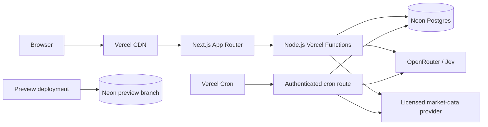

# Jev Trade: Vercel runtime architecture

**Research date:** 2026-09-19  
**Status:** implementation recommendation  
**Scope:** Vercel deployment, scheduled work, persistence, secrets, HTTP security, and custom-domain operations for the Next.js prototype

## Decision

Use Vercel for the public Next.js application and Neon Postgres, provisioned through the Vercel Marketplace, for all authoritative state. Run the app on the Node.js runtime in the same region as Neon. Replace the planned long-running box worker with short, authenticated Vercel Cron invocations that claim bounded jobs from Postgres. Preserve the plan's append-only rules in database permissions, constraints, and transaction-scoped procedures.

The first online deployment may run in **fixture mode without a database**. In that mode it is a read-only product demonstration: committed synthetic fixtures and precomputed Jev responses drive the browse, stock, chart, methodology, portfolio, and scorecard views; a visitor's game pick may live in browser storage only and must be labeled as local to that browser. No forecast, visitor pick, score, position, or audit receipt is represented as durable or prospective. Server-memory or `/tmp` writes are forbidden because Vercel Functions have a read-only filesystem with only ephemeral `/tmp` scratch space. ([Vercel Runtimes, updated 2025-12-08](https://vercel.com/docs/functions/runtimes))

The public real-data mode remains closed until the database, licensed market-data feed, provider-rights record, restore evidence, rate limits, and release gates in the product plan exist. Vercel hosting does not change that gate.

## Runtime topology



Recommended concrete choices:

| Concern | Choice | Reason |
|---|---|---|
| Web framework | Next.js App Router on Vercel | Native deployment path, server rendering, route handlers, preview URLs |
| Runtime | Node.js 22 | Matches repository doctrine; Vercel supports `22.x` when pinned in `package.json` ([supported Node.js versions, updated 2025-11-25](https://vercel.com/docs/functions/runtimes/node-js/node-js-versions)) |
| Package manager | pnpm pinned with `packageManager` plus committed lockfile | Vercel uses the lockfile and honors Corepack's `packageManager` value ([package managers, updated 2026-01-13](https://vercel.com/docs/package-managers)) |
| Region | Vercel `iad1` and Neon AWS `us-east-1` initially | Co-locates compute and data; Vercel's current default is `iad1` and recommends placing functions near their data source ([function regions, updated 2026-01-05](https://vercel.com/docs/functions/configuring-functions/region)) |
| Durable store | Neon Postgres via Vercel Marketplace | Relational constraints and ACID transactions fit the immutable ledger and projections; Vercel injects integration credentials ([Marketplace Storage, updated 2026-01-24](https://vercel.com/docs/marketplace-storage)) |
| Database access | `@neondatabase/serverless` over a pooled connection | Designed for serverless HTTP/WebSocket use; Neon recommends pooled endpoints for serverless connection counts ([serverless driver GA, 2025-03-25](https://neon.com/blog/serverless-driver-ga), [connection pooling](https://neon.com/docs/connect/connection-pooling)) |
| Scheduling | Vercel Cron calling Node route handlers | No always-on worker is available; production-only HTTP schedules are a suitable EOD coordinator |
| Operator actions | Local signed scripts and Neon/Vercel consoles for the prototype | Avoids exposing the box plan's loopback-only operator service as a public Vercel route |

Static assets and public shell content should use the CDN. Dynamic forecast, scorecard, and portfolio reads should come from server components or route handlers. Keep OpenRouter, market-provider, cron, and database calls server-side. Browser code must never receive provider credentials or raw licensed payloads.

## Deployment shape

The project should be linked to the public GitHub repository and use `main` as the production branch. Vercel creates previews for non-production branch pushes and production deployments from the production branch. ([Git deployments, updated 2026-01-07](https://vercel.com/docs/git))

Required repository controls:

```json
{
  "engines": { "node": "22.x" },
  "packageManager": "pnpm@<pinned-version>"
}
```

1. Commit `pnpm-lock.yaml`; use `pnpm install --frozen-lockfile` and `pnpm build` in CI.
2. Keep the Vercel root directory at the repository root and framework preset at Next.js.
3. Connect GitHub so pull requests receive isolated preview deployments.
4. Disable automatic custom-domain assignment to unverified production builds if the plan supports staged production releases. Vercel can build a staged production deployment and promote it after checks. ([Promoting deployments, updated 2025-09-24](https://vercel.com/docs/deployments/promoting-a-deployment))
5. Do not run production schema migrations opportunistically in `next build`. A migration can run more than once when builds overlap. Run an idempotent, locked migration command once before promotion, using a non-runtime migration credential. Prefer additive schema changes, deploy code compatible with both schema versions, then remove obsolete structures in a later release.
6. Keep an already validated production deployment available for Vercel Instant Rollback. Database changes require their own forward-fix or restore procedure; rolling back the application does not roll back Postgres.

Pin a current patched Next.js release and keep dependency update checks active. The May 2026 security release fixed high-severity authorization-bypass and denial-of-service issues; Vercel states that patching is the complete mitigation for those advisories. ([Next.js May 2026 security release](https://vercel.com/changelog/next-js-may-2026-security-release))

## Environment and secret contract

Use separate Vercel values for Production and Preview. Do not make Preview point at production data or production provider accounts.

| Variable | Production | Preview | Fixture-only deployment |
|---|---:|---:|---:|
| `APP_MODE=live\|fixture` | `live` after gates | `fixture` or isolated test | `fixture` |
| `DATABASE_URL` | Neon pooled production URL | Neon preview branch URL | absent |
| `DATABASE_MIGRATION_URL` | direct URL, migration job only | preview direct URL | absent |
| `OPENROUTER_API_KEY` | sensitive | separate restricted key | absent if responses are precomputed |
| `CRON_SECRET` | sensitive, random 32+ bytes | absent; Vercel cron runs only in production | absent |
| `MARKET_DATA_API_KEY` | sensitive after rights approval | development-only key if contract permits | absent |
| `PUBLIC_MARKET_DATA` | `true` only after rights record is active | `false` | `false` |
| `DURABLE_WRITES` | `true` only with migrated DB | `true` only on isolated DB | `false` |
| `APP_ORIGIN` | canonical HTTPS origin | generated preview origin | generated production origin |

Add credentials with `vercel env add NAME production --sensitive` or the dashboard. Sensitive variables are hidden after creation; ordinary environment values are encrypted at rest. A variable change affects only later deployments, so redeploy after any change. Prefer `vercel env run` for local commands that need secrets instead of pulling them into a file. ([Vercel env CLI, updated 2026-01-13](https://vercel.com/docs/cli/env), [environment management, updated 2026-03-12](https://vercel.com/docs/environment-variables/manage-across-environments))

Never use a `NEXT_PUBLIC_` prefix for any credential. Do not print environment objects, connection URLs, authorization headers, provider request bodies, or licensed source payloads. Logs should contain an operation ID, safe status code, latency, provider name, model/version, input hash, and redacted error class.

Vercel Marketplace can provision and connect Neon from the linked project with `vercel integration add neon`; the CLI can scope the resource to environments and inject its connection variables. ([Vercel integration CLI, updated 2026](https://vercel.com/docs/cli/integration)) Enable a branch per Preview deployment so schema and write tests cannot affect production. Neon documents isolated copy-on-write branches for Vercel previews and automatic cleanup. ([Neon/Vercel preview branches, 2025-02-20](https://neon.com/blog/neon-vercel-native-integration), [integration update, 2025-11-18](https://neon.com/blog/big-dx-improvements-for-neon-users-on-vercel))

## Durable append-only storage

Postgres is authoritative. Vercel cache, browser storage, process memory, and `/tmp` are never authoritative.

Use immutable domain tables for:

- source snapshots and their hashes;
- typed Jev request/response records and model/question versions;
- published forecasts and lifecycle events;
- paper-portfolio events;
- visitor blind picks;
- resolutions, score inputs, and correction links;
- provider-rights and release-gate events;
- publication roots and external-attestation receipts;
- job intents and job-attempt events.

Use ordinary views or reproducible queries for current positions and scorecards at first. A mutable materialized projection may be introduced for performance, but it is disposable and rebuildable from immutable events.

Enforce immutability in three layers:

1. Runtime roles receive no `UPDATE`, `DELETE`, or `TRUNCATE` privilege on domain-event tables.
2. `BEFORE UPDATE OR DELETE` triggers reject changes even if a privilege is granted accidentally. Corrections append a new event that references the superseded event.
3. Runtime writes go through narrow, versioned database functions that validate state transitions, create all related records in one transaction, and return the already-existing result when an idempotency key repeats.

Use at least these database roles:

| Role | Capability |
|---|---|
| migration owner | Schema changes only; never loaded by web or cron runtime |
| public reader | `SELECT` on approved public views only |
| public ingest | `EXECUTE` on the bounded visitor-pick function only |
| worker | `EXECUTE` on snapshot, judgment, forecast, resolution, and portfolio-event procedures |
| operator | Narrow correction/replay procedures; no table ownership |

A Vercel Marketplace resource usually begins with one injected owner-like connection URL. Before `DURABLE_WRITES=true`, create the restricted roles and store distinct sensitive URLs for each runtime capability. If separate function-level credentials are impractical in the first deployment, use one restricted runtime role and keep migrations outside Vercel Functions; do not ship an owner credential as the steady-state `DATABASE_URL`.

Every publication transaction should:

1. claim an idempotency key such as `forecast:<market-session>:<symbol>:<mode>:<contract-version>`;
2. lock the relevant job or stream-head row with `FOR UPDATE`;
3. insert the frozen source snapshot, validated Jev record, forecast, and ledger event;
4. advance a mutable stream-head/control row while leaving domain records immutable;
5. commit before any public response or cache invalidation.

Store exact cutoff/session timestamps, canonical input and output hashes, market-data/provider version, model ID, question version, policy version, and code/deployment SHA. The hash chain detects later mutation; it does not prove that a pre-publication input was truthful, so the external attestation gate remains necessary.

Use the Neon pooled URL for ordinary request and cron work. Neon pooling uses transaction mode, so do not rely on session state or session-level advisory locks. Use row locks or transaction-level locking inside a single transaction. ([Neon connection pooling](https://neon.com/docs/connect/connection-pooling))

Enable Neon point-in-time recovery or snapshots at a retention level that satisfies the release plan, plus an independent encrypted logical export for long-term recovery. Perform and record a restore rehearsal. Neon supports branch restore within the configured history window, but provider recovery should not be the only copy of the ledger. ([Neon point-in-time restore](https://neon.com/blog/announcing-point-in-time-restore), [Neon snapshots, 2025-11-11](https://neon.com/blog/three-ways-to-use-your-snapshots))

## Scheduled execution

Define Vercel Cron entries in `vercel.json`. Cron schedules are UTC, call an HTTP `GET` path on the production deployment, and do not run for Preview deployments. ([Cron quickstart, updated 2026-01-13](https://vercel.com/docs/cron-jobs/quickstart), [Cron reference, updated 2025-06-25](https://vercel.com/docs/cron-jobs))

Recommended initial schedule:

```json
{
  "$schema": "https://openapi.vercel.sh/vercel.json",
  "crons": [
    { "path": "/api/cron/eod", "schedule": "30 23 * * *" },
    { "path": "/api/cron/reconcile", "schedule": "30 1 * * *" }
  ]
}
```

`23:30 UTC` is after the regular US cash close in both daylight and standard time. The route still uses an exchange calendar and provider availability checks; weekends, holidays, early closes, and delayed EOD files become explicit no-op or retry states. The second daily route recovers pending work. Do not encode market-session truth in the cron expression.

Both routes must:

- reject the request unless `Authorization` exactly matches `Bearer ${CRON_SECRET}` and the secret is configured;
- avoid redirects, because Vercel Cron does not follow them;
- create a scheduled-operation ID in Postgres before work starts;
- use unique idempotency constraints plus a transaction lock, because Vercel can overlap invocations and occasionally deliver a cron event more than once;
- process a bounded batch and leave remaining jobs queued for reconciliation;
- record each attempt and terminal status without rewriting the forecast;
- set an explicit `maxDuration` below the plan limit and apply shorter timeouts to market and Jev calls;
- return `2xx` only after the database reflects the result.

Vercel does not retry a failed cron invocation. Its documentation recommends locks and idempotency for overlap and duplicate delivery. Function duration limits also apply to cron handlers. ([Managing Cron Jobs, updated 2026-01-28](https://vercel.com/docs/cron-jobs/manage-cron-jobs))

Hobby Cron can run a job only once per day and may invoke it anywhere within the selected hour. Pro and Enterprise support per-minute schedules, but Vercel still does not guarantee exact timing. The two daily routes above fit Hobby for the fixture and low-volume EOD prototype; move to Pro or a durable workflow service if the permitted live provider requires narrow post-close timing, faster recovery, or more than one processing wave. ([Cron usage and pricing, updated 2026-01-28](https://vercel.com/docs/cron-jobs/usage-and-pricing))

New deployments do not stop a cron invocation already running, and Instant Rollback does not update active cron schedules. The release checklist must inspect the project Cron Jobs page after a schedule change or rollback.

## Fixture mode before Neon exists

Fixture mode is safe to deploy if all of these rules hold:

- Data files are synthetic or explicitly redistributable and committed with provenance.
- Jev results are committed fixtures tied to request/model/question versions, or generated locally during development and then frozen. A public anonymous route must not spend OpenRouter credit in fixture mode.
- The server exposes only reads. Mutation endpoints return `503 DURABLE_WRITES_DISABLED` rather than falling back to process memory.
- Browser-only picks use `localStorage`, are clearly labeled “saved on this browser,” and do not enter public aggregate metrics.
- Forecast and scorecard pages say “fixture demonstration” and never label results as live, prospective, verified, or market-current.
- `/api/health` reports safe capability flags such as `mode=fixture`, `database=false`, `durableWrites=false`, `publicMarketData=false`; it does not expose environment values.
- Cron routes are absent or return a no-op while `DURABLE_WRITES=false`.

Fixture mode can demonstrate responsive UI, risk-label separation, deterministic calculations, forecast lifecycle states, charts, game feedback, methodology, empty/error states, and an entire seeded paper-portfolio history. It cannot support authoritative visitor picks, new published forecasts, an auditable live portfolio, prospective scoring, corrections, external attestations, or durable operator recovery.

## HTTP and application security

Set response headers through `next.config.ts`; Vercel recommends framework-level headers for Next.js. ([Vercel response headers, updated 2026-02-09](https://vercel.com/docs/headers/response-headers), [project configuration, updated 2025-12-19](https://vercel.com/docs/project-configuration/vercel-json))

Baseline production policy:

- `Content-Security-Policy`: start in report-only mode, inventory the shipped chart/analytics/font needs, then enforce `default-src 'self'`, `object-src 'none'`, `base-uri 'self'`, `frame-ancestors 'none'`, and narrow `script-src`, `style-src`, `img-src`, `font-src`, `connect-src`, and `form-action`. Provider calls are server-side and need no browser CSP allowlist.
- `Strict-Transport-Security: max-age=31536000`; add `includeSubDomains` only after confirming every subdomain is HTTPS. Do not request preload casually.
- `X-Content-Type-Options: nosniff`.
- `Referrer-Policy: strict-origin-when-cross-origin`.
- `Permissions-Policy: camera=(), microphone=(), geolocation=(), payment=()`.
- `Cross-Origin-Opener-Policy: same-origin` unless a verified integration requires otherwise.
- `X-Frame-Options: DENY` as defense in depth with CSP `frame-ancestors 'none'`.

Use same-origin routes and do not enable broad CORS. Send `Cache-Control: no-store` on mutation responses, health details, error payloads, and any future operator response. Public immutable forecast pages may use CDN revalidation only after the database transaction commits; cache keys must include immutable forecast IDs and public methodology/version fields.

Keep the public mutation surface to the blind-pick procedure. Validate body size and schema, generate server-side IDs, bind picks to a forecast and reveal cutoff, apply an expiring privacy-minimized visitor token, and rate-limit the route. Vercel WAF supports path-based fixed-window rate limits on all plans; begin in log mode, then enforce a conservative threshold on pick and any AI-backed endpoint. ([Vercel WAF rate limiting, updated 2025-09-24](https://vercel.com/docs/vercel-firewall/vercel-waf/rate-limiting), [Vercel Firewall, updated 2026-02-09](https://vercel.com/docs/vercel-firewall))

Do not put an operator UI or replay endpoint in the public project for the first prototype. Run version activation, correction, and replay through audited local scripts using short-lived operator credentials. If a web operator console is later necessary, deploy it as a separate project with its own restricted database role, Vercel Deployment Protection or SSO, origin checks, short sessions, and no public-domain alias. Hobby's standard protection does not protect a public production custom domain; protecting production domains requires a qualifying paid plan. ([Deployment Protection, updated 2026-01-07](https://vercel.com/docs/deployment-protection))

Leave Vercel build-log and source protection enabled. Vercel says `/_src` and `/_logs` are team-only by default. ([Project security settings, updated 2026-01-13](https://vercel.com/docs/project-configuration/security-settings))

## Custom domain procedure

The domain owner can perform this after a successful production deployment:

1. Add `jev-trade.dev` to the Vercel project under **Settings → Domains**, or use `vercel domains add jev-trade.dev jev-trade`.
2. At the DNS provider, create the exact record Vercel displays. Vercel's current guidance is an A record for an apex and a CNAME for a subdomain; use the dashboard's current target rather than a copied historical IP.
3. If Vercel requests ownership verification, add the displayed TXT record.
4. Choose one canonical host and redirect the other, for example apex canonical with `www` redirect.
5. Wait for DNS propagation and Vercel's certificate issuance, then verify HTTPS and the certificate chain. Vercel automatically requests a Let's Encrypt certificate after DNS validation. ([Adding a domain, updated 2025-09-24](https://vercel.com/docs/domains/working-with-domains/add-a-domain), [SSL certificates, updated 2025-11-25](https://vercel.com/docs/domains/working-with-ssl))
6. Verify `curl -I https://jev-trade.dev`, the canonical redirect, security headers, `/api/health`, robots metadata, Open Graph output, and the absence of fixture/live ambiguity.

Domain attachment points to the current Production deployment, so keep automatic assignment off until release gates pass if the account supports staged promotion. Domain and certificate readiness do not authorize live market-data display.

## Provisioning and release prerequisites

Fixture production deployment:

- Vercel account authenticated and local repository linked to project `jev-trade`.
- GitHub repository connected; `main` configured as production.
- Node 22 and pinned pnpm configuration committed.
- Fixture-only build, unit tests, browser smoke tests, and security-header checks pass.
- `APP_MODE=fixture`, `PUBLIC_MARKET_DATA=false`, and `DURABLE_WRITES=false` in Production.
- No production credential is required by the fixture build.
- Fixture disclosures and local-storage wording are visible.

Durable restricted deployment:

- Neon resource provisioned in the same region, Preview branching enabled, and production/preview credentials isolated.
- Migrations applied; restricted database roles and immutable-table triggers verified.
- Duplicate-publication, correction-chain, future-data, and rebuild-from-events tests pass against Postgres.
- `CRON_SECRET`, OpenRouter key, database URLs, and any permitted development data key stored as sensitive values.
- Cron handlers pass unauthorized, duplicate-delivery, overlap, timeout, and reconciliation tests.
- PITR/snapshot policy selected and one restore rehearsal recorded.
- WAF rate limit active on public write and paid-upstream routes.

Public live-data deployment:

- Written market-data display and derived-data rights recorded and active.
- Production data key, retention terms, attribution, freshness, and outage behavior verified.
- Prospective-scorecard, external-attestation, disclosure, backup, rollback, privacy, and independent-review gates from the product plan pass.
- Custom domain and canonical redirects verified after promotion.

## Material risks and controls

| Risk | Consequence | Control / release condition |
|---|---|---|
| Treating function disk or memory as durable | Lost or divergent ledger events | All authority in Postgres; fixture mutations fail closed |
| Cron duplicate or overlap | Double forecasts, fills, or scores | Unique idempotency keys, row/transaction locks, bounded job claims |
| Cron failure has no platform retry | Missed EOD publication or resolution | Persist job intent first; daily reconciler; alert pending/failed jobs |
| Hobby scheduling is imprecise | EOD data unavailable at invocation | Provider readiness check and reconciliation; use Pro/durable workflow if timing becomes contractual |
| Serverless function duration | Partial batch or timeout | Short upstream timeouts, small batches, committed checkpoints, reconciliation |
| Owner database URL in runtime | Ledger mutability and broad breach impact | Separate roles/URLs; migration credential outside runtime; deny update/delete/truncate |
| Schema/application rollback mismatch | Old app cannot read new schema | Additive migrations, compatibility window, staged promotion, explicit DB recovery plan |
| Shared Preview/Production database | Test data corrupts public history | Neon branch per Preview and environment-scoped variables |
| Anonymous AI endpoint abuse | OpenRouter cost and availability incident | No anonymous AI route in fixture mode; authenticated cron only; WAF and spend caps |
| Secret leakage through logs or client bundles | Credential compromise | Sensitive env values, no `NEXT_PUBLIC_`, structured redaction, no payload/header logging |
| Unlicensed market-data display | Contract and takedown exposure | `PUBLIC_MARKET_DATA=false` until recorded rights gate passes |
| Public operator endpoint | Ledger manipulation | No operator HTTP surface in v1; separate protected project if later required |
| Cached stale or pre-commit state | Visitor sees inconsistent forecast | Cache only immutable IDs after commit; `no-store` for mutations and health/error details |
| Single database region/provider incident | Reads or scheduled writes unavailable | Failure states preserve prior records; PITR/snapshots; independent logical export; documented recovery |
| Domain DNS or certificate delay | Custom host unavailable | Keep generated Vercel URL for verification; attach domain only after successful production deploy |

## Acceptance evidence

The Vercel architecture is ready for implementation when the repository contains:

- a pinned Node/pnpm build and clean Vercel preview;
- capability-gated fixture/live configuration with fail-closed validation;
- `vercel.json` cron definitions and authenticated, idempotent handlers;
- Postgres migrations proving append-only privileges, immutable triggers, idempotency, and event-derived rebuilds;
- separate Preview and Production database evidence;
- HTTP header and cache-policy tests;
- deployment, rollback, cron reconciliation, secret rotation, database restore, and domain runbooks;
- a fixture deployment whose UI and health response state its non-durable, non-live status accurately.
